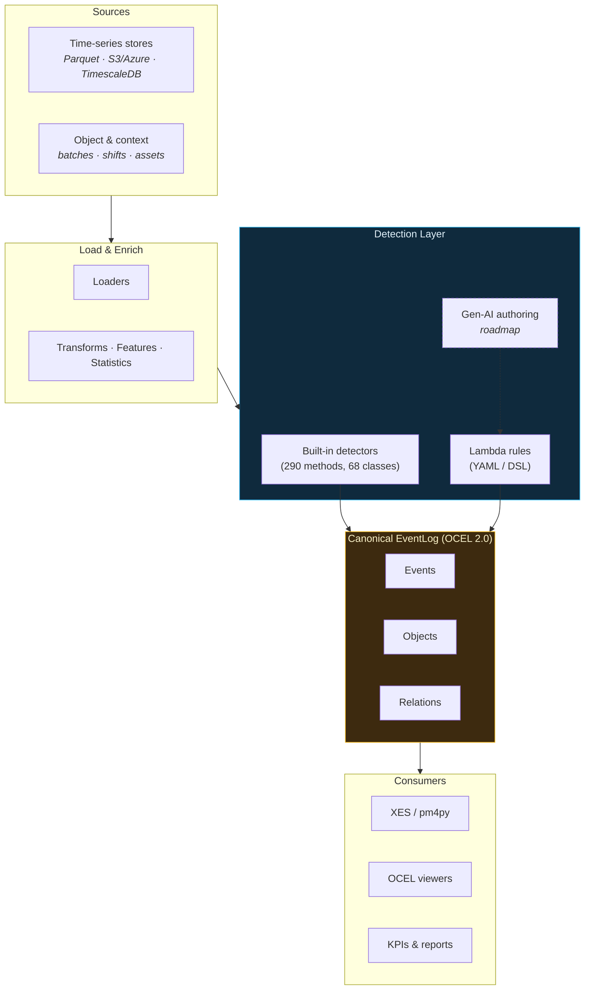

# Concept

ts-shape is a lightweight toolkit for shaping timeseries data into analysis-ready DataFrames.

## Architecture

A layered, abstract view of the pipeline. The detection layer is intentionally pluggable — see [Lambda Rules](guides/lambda-rules.md) for the user-authored path.



## Core Principles

| Principle | Description |
|-----------|-------------|
| **DataFrame-First** | Every operation accepts and returns Pandas DataFrames |
| **Modular** | Use only what you need - all components are decoupled |
| **Composable** | Chain operations together like building blocks |
| **Consistent Schema** | Simple, predictable data structure |

## Data Model

### Timeseries DataFrame

| Column | Type | Description |
|--------|------|-------------|
| `uuid` | string | Signal/sensor identifier |
| `systime` | datetime | Timestamp (tz-aware recommended) |
| `value_double` | float | Numeric measurements |
| `value_integer` | int | Counter/integer values |
| `value_string` | string | Categorical data |
| `value_bool` | bool | Binary states |
| `is_delta` | bool | Delta vs absolute (optional) |

### Metadata DataFrame

| Column | Type | Description |
|--------|------|-------------|
| `uuid` | string | Signal identifier (join key) |
| `label` | string | Human-readable name |
| `unit` | string | Measurement unit |
| `config.*` | any | Additional configuration |

## Module Reference

### Loaders

| Module | Source | Method |
|--------|--------|--------|
| `ParquetLoader` | Local/remote parquet | `load_all_files()` |
| `S3ProxyParquetLoader` | S3-compatible storage | `fetch_data_as_dataframe()` |
| `AzureBlobLoader` | Azure Blob containers | `fetch_data_as_dataframe()` |
| `TimescaleLoader` | TimescaleDB | `fetch_data_as_dataframe()` |
| `MetadataLoader` | JSON files | `to_df()` |

### Transforms

| Module | Purpose |
|--------|---------|
| `NumericFilter` | Filter by numeric range, null handling |
| `StringFilter` | Pattern matching, contains, regex |
| `DateTimeFilter` | Time range, weekday, hour filters |
| `BooleanFilter` | Flag-based row filtering |
| `CustomFilter` | Flexible pandas query syntax filtering |
| `NumericCalc` | Derived columns, calculations |
| `TimezoneShift` | Convert between timezones |
| `TimestampConverter` | Parse/format timestamps |
| `LambdaProcessor` | Apply custom functions to columns |

### Features

| Module | Output |
|--------|--------|
| `NumericStatistics` | min, max, mean, std, percentiles |
| `TimestampStats` | first, last, count, coverage |
| `StringStatistics` | value counts, cardinality |
| `CycleExtractor` | Cycle detection, validation, method suggestion |

### Events - Quality

| Module | Detection |
|--------|-----------|
| `OutlierDetection` | Z-score, IQR, MAD, IsolationForest |
| `StatisticalProcessControl` | Western Electric Rules, CUSUM shifts |
| `ToleranceDeviation` | Specification violations, Cp/Cpk indices |

### Events - Production (Event Detection)

| Module | Purpose |
|--------|---------|
| `MachineStateEvents` | Run/idle intervals, state transitions, rapid change detection |
| `LineThroughputEvents` | Parts per window, takt adherence, throughput trends |
| `ChangeoverEvents` | Product changeover detection, stability-based windows |
| `FlowConstraintEvents` | Blocked/starved detection between stations |

### Events - Production (Daily Tracking)

| Module | Purpose |
|--------|---------|
| `PartProductionTracking` | Production by part, daily summaries, totals |
| `CycleTimeTracking` | Cycle times, slow cycles, trends |
| `DowntimeTracking` | Downtime by shift/reason, availability |
| `QualityTracking` | NOK/scrap analysis, FPY, defect reasons |
| `ShiftReporting` | Shift production, targets, comparisons |

### Events - Production (OEE & Advanced)

| Module | Purpose |
|--------|---------|
| `OEECalculator` | Availability x Performance x Quality — daily OEE |
| `AlarmManagementEvents` | ISA-18.2 alarm analysis, chattering, standing alarms |
| `BatchTrackingEvents` | Batch detection, duration stats, yield, transition matrix |
| `BottleneckDetectionEvents` | Station utilization, shifting bottleneck detection |
| `MicroStopEvents` | Brief idle intervals, frequency, impact analysis |
| `DutyCycleEvents` | On/off patterns, excessive cycling detection |

### Events - Production (Traceability)

| Module | Purpose |
|--------|---------|
| `ValueTraceabilityEvents` | Single ID tracking across stations |
| `RoutingTraceabilityEvents` | ID + routing/state signal correlation, lead times |
| `MultiProcessTraceabilityEvents` | Parallel process lines with handover events |

### Events - Production (Performance & Targets)

| Module | Purpose |
|--------|---------|
| `PerformanceLossTracking` | Speed loss vs target cycle time per shift |
| `ScrapTracking` | Material waste by shift, reason, and monetary cost |
| `TargetTracking` | Actual vs target comparison, hit rate |
| `SetupTimeTracking` | SMED analysis — setup durations by product transition |
| `OperatorPerformanceTracking` | Operator output, efficiency, quality comparison |
| `ReworkTracking` | Rework rates by shift/reason, cost analysis |

### Events - Production (Reporting)

| Module | Purpose |
|--------|---------|
| `ShiftHandoverReport` | Auto-generated shift reports with issue highlighting |
| `PeriodSummary` | Weekly/monthly aggregation, period comparison |

### Events - Engineering

| Module | Purpose |
|--------|---------|
| `SetpointChangeEvents` | Step/ramp detection, settling, overshoot |
| `StartupDetectionEvents` | Threshold, slope, multi-signal startup detection |
| `ThresholdMonitoringEvents` | Multi-level thresholds with hysteresis |
| `RateOfChangeEvents` | Rapid change and step jump detection |
| `SteadyStateDetectionEvents` | Steady vs transient period segmentation |
| `SignalComparisonEvents` | Setpoint vs actual divergence |
| `OperatingRangeEvents` | Operating envelope and regime change |
| `WarmUpCoolDownEvents` | Warm-up/cool-down curve analysis |
| `ProcessWindowEvents` | Windowed statistics for shift monitoring |
| `ControlLoopHealthEvents` | PID loop health, oscillation, saturation |
| `DisturbanceRecoveryEvents` | Upset detection and recovery time |
| `MaterialBalanceEvents` | Input/output balance checks |
| `ProcessStabilityIndex` | Composite 0-100 stability score |

## Advanced Capabilities

### Quality & SPC

| Feature | Module | Method |
|---------|--------|--------|
| CUSUM Shift Detection | `StatisticalProcessControl` | `detect_cusum_shifts()` |
| Western Electric Rules | `StatisticalProcessControl` | `apply_rules_vectorized()` |
| Rule Interpretations | `StatisticalProcessControl` | `interpret_violations()` |
| Dynamic Control Limits | `StatisticalProcessControl` | `calculate_dynamic_control_limits()` |
| Process Capability (Cp/Cpk) | `ToleranceDeviation` | `compute_capability_indices()` |

### Outlier Detection Methods

| Method | Description | Best For |
|--------|-------------|----------|
| Z-score | Distance from mean in std units | Normal distributions |
| IQR | Interquartile range based | Skewed distributions |
| MAD | Median Absolute Deviation | Robust to extremes |
| IsolationForest | ML-based anomaly detection | Complex patterns |

### Cycle Analysis

| Feature | Method | Description |
|---------|--------|-------------|
| Method Suggestion | `suggest_method()` | Auto-detect best extraction method |
| Cycle Validation | `validate_cycles()` | Validate duration constraints |
| Overlap Detection | `detect_overlapping_cycles()` | Find and resolve overlaps |
| Extraction Stats | `get_extraction_stats()` | Track success rate |

### Production Tracking

| Feature | Module | Key Methods |
|---------|--------|-------------|
| Machine State | `MachineStateEvents` | `detect_run_idle()`, `transition_events()`, `state_quality_metrics()` |
| Line Throughput | `LineThroughputEvents` | `count_parts()`, `takt_adherence()`, `throughput_trends()` |
| Changeovers | `ChangeoverEvents` | `detect_changeover()`, `changeover_window()` |
| Flow Constraints | `FlowConstraintEvents` | `blocked_events()`, `starved_events()`, `flow_constraint_analytics()` |
| Part Tracking | `PartProductionTracking` | `production_by_part()`, `daily_production_summary()` |
| Cycle Times | `CycleTimeTracking` | `cycle_time_statistics()`, `detect_slow_cycles()`, `cycle_time_trend()` |
| Downtime | `DowntimeTracking` | `downtime_by_shift()`, `downtime_by_reason()`, `availability_trend()` |
| Quality/NOK | `QualityTracking` | `nok_by_shift()`, `quality_by_part()`, `nok_by_reason()` |
| Shift Reports | `ShiftReporting` | `shift_production()`, `shift_targets()`, `shift_comparison()` |

### OEE & Plant Analytics

| Feature | Module | Key Methods |
|---------|--------|-------------|
| OEE | `OEECalculator` | `calculate_oee()`, `calculate_availability()`, `calculate_performance()` |
| Alarms | `AlarmManagementEvents` | `alarm_frequency()`, `chattering_detection()`, `standing_alarms()` |
| Batches | `BatchTrackingEvents` | `detect_batches()`, `batch_duration_stats()`, `batch_yield()` |
| Bottlenecks | `BottleneckDetectionEvents` | `detect_bottleneck()`, `shifting_bottleneck()`, `station_utilization()` |
| Micro-Stops | `MicroStopEvents` | `detect_micro_stops()`, `micro_stop_frequency()`, `micro_stop_impact()` |
| Duty Cycles | `DutyCycleEvents` | `on_off_intervals()`, `duty_cycle_per_window()`, `excessive_cycling()` |

### Traceability

| Feature | Module | Key Methods |
|---------|--------|-------------|
| Value Trace | `ValueTraceabilityEvents` | `build_timeline()`, `lead_time()`, `station_statistics()` |
| Routing Trace | `RoutingTraceabilityEvents` | `build_routing_timeline()`, `lead_time()`, `routing_paths()` |
| Multi-Process | `MultiProcessTraceabilityEvents` | `build_timeline()`, `parallel_activity()`, `handover_log()` |

### Performance & Targets

| Feature | Module | Key Methods |
|---------|--------|-------------|
| Performance Loss | `PerformanceLossTracking` | `performance_by_shift()`, `slow_periods()`, `performance_trend()` |
| Scrap | `ScrapTracking` | `scrap_by_shift()`, `scrap_by_reason()`, `scrap_cost()` |
| Targets | `TargetTracking` | `compare_to_target()`, `target_achievement_summary()`, `target_hit_rate()` |
| Setup Time | `SetupTimeTracking` | `setup_durations()`, `setup_by_product()`, `setup_trend()` |
| Operator | `OperatorPerformanceTracking` | `production_by_operator()`, `operator_efficiency()`, `quality_by_operator()` |
| Rework | `ReworkTracking` | `rework_by_shift()`, `rework_by_reason()`, `rework_cost()` |
| Shift Handover | `ShiftHandoverReport` | `generate_report()`, `highlight_issues()`, `from_shift_data()` |
| Period Summary | `PeriodSummary` | `weekly_summary()`, `monthly_summary()`, `compare_periods()` |

### Control Quality KPIs

| Feature | Module | Method |
|---------|--------|--------|
| Time to Settle | `SetpointChangeEvents` | `time_to_settle()` |
| Rise Time | `SetpointChangeEvents` | `rise_time()` |
| Overshoot/Undershoot | `SetpointChangeEvents` | `overshoot_metrics()` |
| Oscillation Analysis | `SetpointChangeEvents` | `oscillation_frequency()` |
| Decay Rate | `SetpointChangeEvents` | `decay_rate()` |
| Comprehensive Metrics | `SetpointChangeEvents` | `control_quality_metrics()` |

## Pipeline Pattern

```python
# 1. LOAD
from ts_shape.loader.timeseries.parquet_loader import ParquetLoader
from ts_shape.loader.metadata.metadata_json_loader import MetadataLoader

ts_df = ParquetLoader.load_all_files("data/")
meta_df = MetadataLoader("config/signals.json").to_df()

# 2. COMBINE
from ts_shape.loader.combine.integrator import DataIntegratorHybrid

df = DataIntegratorHybrid.combine_data(
    timeseries_sources=[ts_df],
    metadata_sources=[meta_df],
    join_key="uuid"
)

# 3. TRANSFORM
from ts_shape.transform.filter.datetime_filter import DateTimeFilter
from ts_shape.transform.filter.numeric_filter import NumericFilter

df = DateTimeFilter.filter_after(df, "systime", "2024-01-01")
df = NumericFilter.filter_not_null(df, "value_double")

# 4. ANALYZE
from ts_shape.features.stats.numeric_stats import NumericStatistics
from ts_shape.events.quality.outlier_detection import OutlierDetection

stats = NumericStatistics(df, "value_double")
outliers = OutlierDetection.detect_zscore_outliers(df, "value_double", threshold=3.0)
```

## Design Decisions

### Why DataFrames?

- **Universal**: Understood by all data scientists
- **Ecosystem**: Works with matplotlib, scikit-learn, etc.
- **Debuggable**: Easy to inspect intermediate results
- **Exportable**: Save to CSV, parquet, database

### Why Modular?

- **Lightweight**: Import only what you need
- **Testable**: Each component works independently
- **Extensible**: Add custom modules easily
- **Maintainable**: Clear separation of concerns

### Why This Schema?

- **Flexible**: Not all columns required
- **Multi-type**: Handles numeric, string, boolean values
- **Joinable**: UUID enables metadata enrichment
- **Sparse-friendly**: Nulls are fine

## Extending ts-shape

### Custom Loader

```python
class MyDatabaseLoader:
    def __init__(self, connection: str):
        self.conn = connection

    def fetch_data_as_dataframe(self, start: str, end: str) -> pd.DataFrame:
        # Query database, return DataFrame with uuid, systime, value_*
        return df
```

### Custom Transform

```python
class MyFilter:
    @staticmethod
    def filter_business_hours(df: pd.DataFrame, column: str) -> pd.DataFrame:
        hours = pd.to_datetime(df[column]).dt.hour
        return df[(hours >= 9) & (hours < 17)]
```

### Custom Feature

```python
class MyMetrics:
    def __init__(self, df: pd.DataFrame, column: str):
        self.data = df[column].dropna()

    def coefficient_of_variation(self) -> float:
        return self.data.std() / self.data.mean()
```

## When to Use ts-shape

| Use Case | ts-shape? |
|----------|-----------|
| Load parquet/S3/Azure/DB into DataFrames | Yes |
| Filter and transform timeseries | Yes |
| Compute statistics on signals | Yes |
| Detect outliers and events | Yes |
| Real-time streaming | No (use Kafka/Flink) |
| Sub-millisecond latency | No (use specialized libs) |
| GPU acceleration | No (use cuDF/Rapids) |
