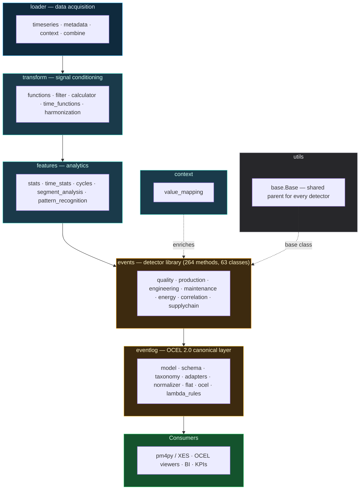

# Architecture

A navigable map of every module in the Python library. The static Mermaid
gives the 30-second overview; the interactive graph below lets you pan,
zoom, search, and click any class or method to jump to its auto-generated
reference page.

## 30-second overview



**Top to bottom = data direction.** Every layer is **optional and
DataFrame-in / DataFrame-out** — you can enter wherever your data
already is. Detectors take any conforming DataFrame; nothing forces
you to use the loaders or feature stage first.

## Interactive map

[:material-map-search: Open the full-screen map →](architecture-map.md){ .md-button .md-button--primary }

The dedicated map page lets you pan, zoom, search by name, filter by
layer, and click any class or method to jump to its reference page.
It uses the same `taxonomy.REGISTRY` as the rest of the library, so
adding a detector + REGISTRY entry automatically updates the map on
the next docs build.

## Layer reference

| Layer | Job | Input | Output | Optional? | Example entry point |
|---|---|---|---|---|---|
| `loader` | Acquire raw timeseries from external stores | Parquet / S3 / Azure / TimescaleDB | long-format DataFrame (`uuid`, `systime`, `value_*`) | yes — skip if you already have a DataFrame | `ParquetLoader`, `AzureBlobParquetLoader` |
| `transform` | Condition signals (filter, resample, harmonise) | long DataFrame | conditioned long DataFrame | yes | `RangeFilter`, `DataHarmonizer` |
| `features` | Derive analytics (stats, cycles, segments) | long DataFrame | wide feature table | yes | `WindowedStats`, `CycleExtractor` |
| `events` | Detect events | DataFrame (raw or feature-enriched) | canonical event DataFrame — `point` / `interval` / `summary` per `src/ts_shape/events/_output.py` | yes | `OEECalculator`, `OutlierDetectionEvents` |
| `eventlog` | Normalise detector output to OCEL 2.0 | canonical event DataFrame | `EventLog(events, objects, relations)` | yes — only needed for XES/OCEL/process-mining | `to_event_log(df, detector=...)` |

## Three ways to enter the pipeline

**1. I already have a DataFrame — just detect events.**

```python
from ts_shape.events.quality.outlier_detection import OutlierDetectionEvents

events = OutlierDetectionEvents(df, value_column="value_double") \
    .detect_outliers_zscore(threshold=3.0)
```

**2. Raw timeseries to events — skip transforms and features.**

```python
from ts_shape.loader.timeseries.parquet_loader import ParquetLoader
from ts_shape.events.production.machine_state import MachineStateEvents

df = ParquetLoader("/data/2026/05/").load_all_files()
intervals = MachineStateEvents(df, run_state_uuid="machine_run_state") \
    .detect_run_idle(min_duration="5s")
```

**3. Full chain — produce a process-mining log.**

```python
from ts_shape.events.production.machine_state import MachineStateEvents
from ts_shape.eventlog import to_event_log, to_ocel_tables

intervals = MachineStateEvents(df, run_state_uuid="machine_run_state") \
    .detect_run_idle()
log = to_event_log(intervals, detector="MachineStateEvents.detect_run_idle")
events_df, objects_df, relations_df = to_ocel_tables(log)
```

## Cross-cutting modules

- **`src/ts_shape/utils/base.py`** — the `Base` parent class every
  detector inherits from (provides the `__init__(dataframe, ...)` and
  `get_dataframe()` interface).
- **`src/ts_shape/events/_output.py`** — canonical event-shape constants
  (`POINT_SCHEMA`, `INTERVAL_SCHEMA`, `SUMMARY_SCHEMA`) and finalize
  helpers (`finalize_point_df`, `finalize_interval_df`,
  `finalize_summary_df`). Single source of truth for the columns every
  detector emits.
- **`src/ts_shape/eventlog/taxonomy.py`** — `REGISTRY` with one
  `LabelRule` per `(ClassName, method_name)` pair. 264 entries today.
  This is also the data source driving every node in the interactive
  graph above.
- **`src/ts_shape/eventlog/archetypes.py`** — eight archetype
  classifications (threshold, interval, aggregate, static, …) enforced
  over the registry.

## Dependency rules

The following invariants hold across the source tree:

- **No detector class imports another detector class.** All
  cross-detector composition happens at the `EventLog` level via
  `concat()`.
- **`eventlog/` does not import `events/`.** Detectors are *referenced
  by name* in `taxonomy.REGISTRY`, not by import. This is what lets
  lambda rules register dynamically without any new code path.
- **`utils.base.Base`** is the only shared parent — there is no other
  cross-package inheritance.
- **`events/_output.py`** is the only schema source for detector
  outputs. Anything emitting a non-canonical column violates the
  contract.
- **Lambda rules** (`src/ts_shape/eventlog/lambda_rules/`) register
  dynamically into `REGISTRY` and run through `normalizer.to_event_log`
  — exactly the same code path as the 63 hand-coded detectors.
