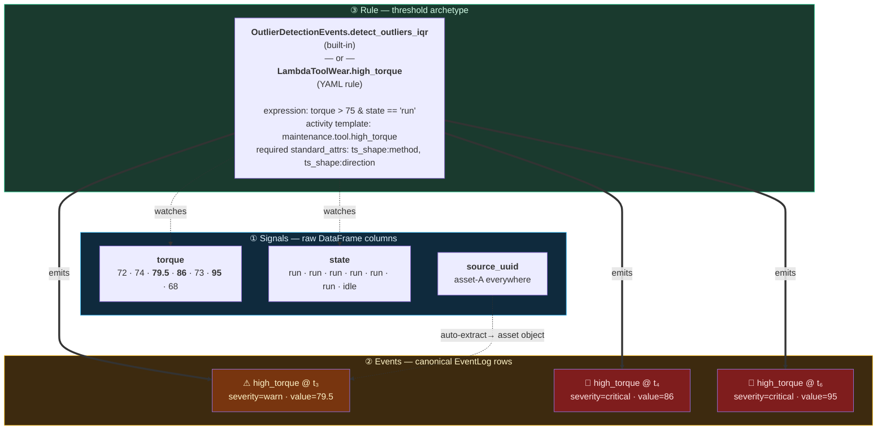
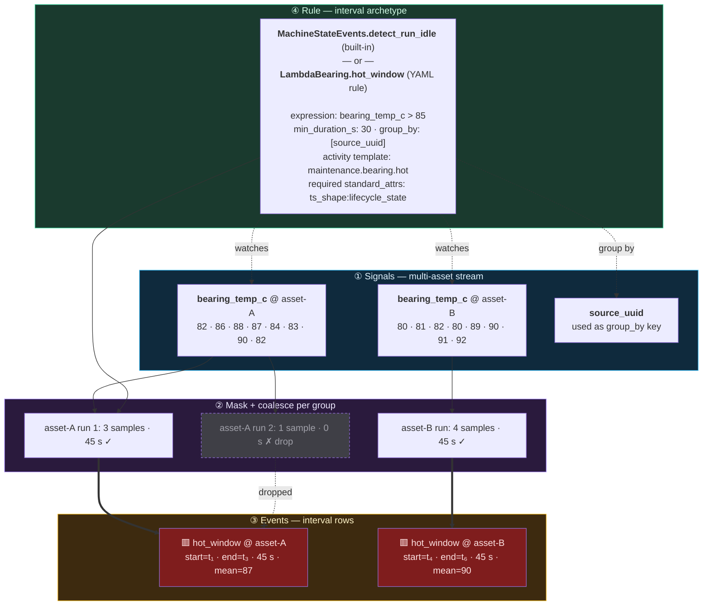
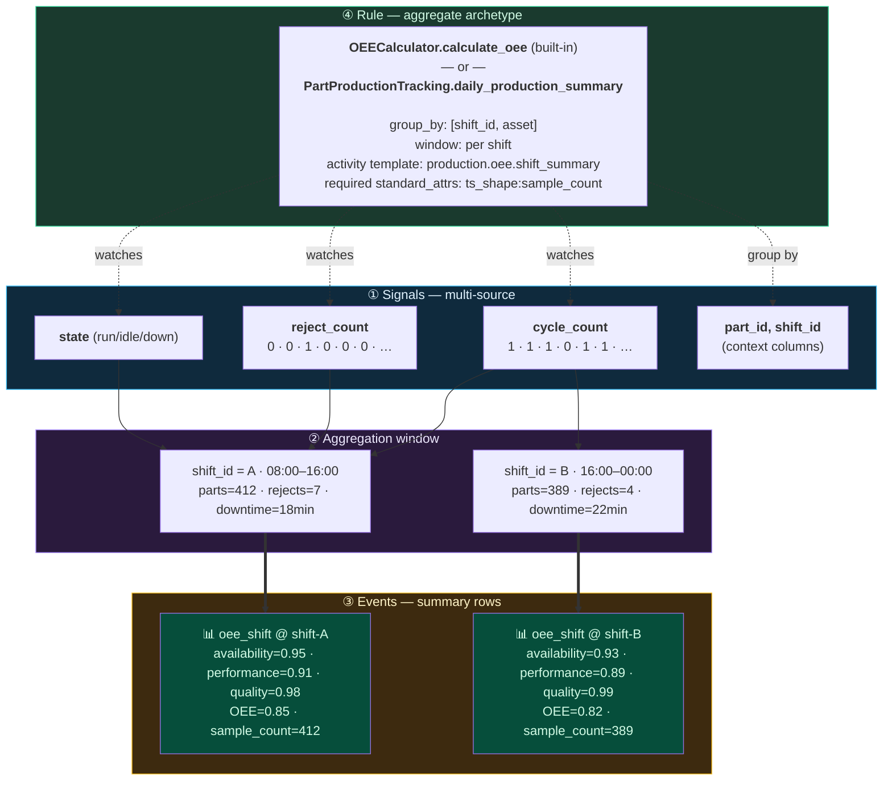
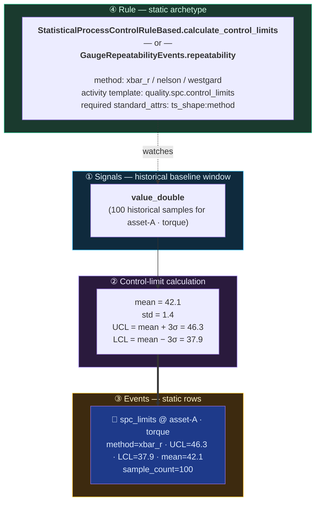

# Event Handling — Visual Overview

!!! note
    This page zooms into the events layer. For the full library map
    with every package, class and detector method — searchable and
    clickable — see [Architecture](architecture.md).

How ts-shape turns raw signals into events. Three layers, four archetypes, one canonical event log.

Every detection in ts-shape — whether it comes from one of the 290 built-in detector methods or a [user-authored lambda rule](lambda-rules.md) — passes through the same three-layer flow:

1. **Signals** — raw timeseries DataFrame columns (booleans, floats, categoricals).
2. **Events** — rows in the canonical `EventLog` produced by a detector method.
3. **Rule** — the code or YAML that defines *when* signals trigger an event, classified into one of four **archetypes**: `threshold`, `interval`, `aggregate`, `static`.

The archetype determines the event's *shape* (point / interval / summary / static), which standard attributes the rule must populate (e.g. `ts_shape:method`, `ts_shape:lifecycle_state`), and which OCEL object types are auto-extracted.

The four diagrams below show one representative scenario per archetype. Read each as a stack: raw signals on top, derived events in the middle, rule definition on the bottom. Dashed links read **rule → signal it watches**; solid links read **rule → event it produces**.

---

## Archetype 1 — `threshold` (point shape)

Per-row check: a single sample compared against a reference. Outliers, SPC violations, tolerance deviations, exceedances. One True row → one point event.

**Representative scenario.** Tool wear: emit one event per torque sample that exceeds 75 Nm while the tool is running.

**Required `standard_attrs` for `threshold`:** `ts_shape:method`, `ts_shape:direction`.

---

## Archetype 2 — `interval` (interval shape)

Contiguous runs of True samples are coalesced (per group) into one event with `start`, `end`, duration. Optional `min_duration_s` filter rejects short blips (hysteresis).

**Representative scenario.** Sustained hot-bearing windows per machine: ignore single-sample spikes, flag any window of ≥ 30 s where `bearing_temp_c > 85`.

**Required `standard_attrs` for `interval`:** `ts_shape:lifecycle_state`.

---

## Archetype 3 — `aggregate` (summary shape)

Window-based statistics. One row per period × group: per-shift OEE, per-day production, hourly cycle-time stats. The event timestamp marks the period end; `ts_shape:start_timestamp` marks the period start.

**Representative scenario.** OEE by shift: roll cycle counts, downtime, and reject counts into one summary row per (shift × asset).

**Required `standard_attrs` for `aggregate`:** `ts_shape:sample_count`.

---

## Archetype 4 — `static` (static shape)

No natural time axis. Reference data, snapshots, top-N tables, gauge R&R results. One event per row, timestamped at the export moment so it still fits the canonical schema.

**Representative scenario.** SPC control-limit calculation: produce a single snapshot per signal capturing UCL/LCL/centre line for downstream rule evaluation.

**Required `standard_attrs` for `static`:** `ts_shape:method`.

---

## Reading the diagrams

| Visual cue | Meaning |
|---|---|
| **Blue subgraph** | Raw signals — DataFrame columns the detector reads. |
| **Purple subgraph** | Intermediate computation (mask, coalescing, aggregation window). Not always present. |
| **Amber subgraph** | Events — rows in the canonical `EventLog`. Color of an event node hints at severity. |
| **Green subgraph** | The rule itself — code (built-in detector class.method) or YAML (lambda rule). |
| **Dashed arrow** | Rule *watches* this signal — it appears as a column reference in the trigger or as a parameter to the detector constructor. |
| **Solid bold arrow** | Rule *emits* this event row. |
| **Dotted X arrow** | Filtered out (e.g., interval shorter than `min_duration_s`). |

---

## Where this fits in the rest of the library

For the full module map — including loaders, transforms, features, and how the event layer plugs into them — see the architecture chart in [Concept](../concept.md#full-library-architecture). For the canonical event-log schema events ultimately land in, see [Event Log (XES & OCEL)](eventlog.md). For the user-authored path that emits straight into this same flow, see [Lambda Rules](lambda-rules.md).
