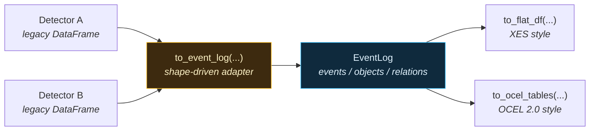

# Event Log: pm4py-shaped output for process mining

Every ts-shape detector returns a pandas DataFrame, but the column names differ between detectors — `systime` vs. `start`/`end`, ad-hoc label columns like `state`, `transition`, `rule_violated`. That makes it hard to feed multiple detectors' output into a single process-mining tool without bespoke glue code.

The `ts_shape.eventlog` package solves this with a **canonical event log** whose column names match the [XES](https://xes-standard.org/) and [OCEL 2.0](https://www.ocel-standard.org/) specs verbatim. ts-shape itself imports no process-mining libraries — the resulting DataFrames can be handed to pm4py / Disco / Celonis / OCEL viewers directly.

---

## At a glance



- One adapter layer normalizes **all 264** public DataFrame-returning detector methods into the same schema.
- The event log keeps OCEL's separation of **events**, **objects**, and **event-to-object relations** — no single "case" is forced.
- `to_flat_df(case_object_type=...)` defers the case-id question to export time: flatten the same log per asset, per batch, per cycle, etc.

---

## The canonical schema

An :class:`EventLog` holds three pandas DataFrames.

### Events

| Column | Type | Notes |
|---|---|---|
| `ocel:eid` | string | Stable UUIDv5 of `(detector, timestamp, row-key)`. |
| `ocel:activity` | string | Dotted activity label, e.g. `production.machine_state.run`. Aliased to `concept:name` on XES export. |
| `ocel:timestamp` | `datetime64[ns, UTC]` | Event time (interval **end** for intervals). Aliased to `time:timestamp`. |
| `ts_shape:start_timestamp` | `datetime64[ns, UTC]` | Interval start; `NaT` for point events. |
| `ts_shape:duration_s` | float | Interval duration in seconds. |
| `ts_shape:detector` | string | `"ClassName.method_name"` — what produced this event. |
| `ts_shape:pack` | string | One of: `quality`, `production`, `engineering`, `maintenance`, `supplychain`, `energy`, `correlation`. |
| `ts_shape:severity` | string | `info` / `warn` / `critical`, mapped from numeric severity scores. |
| `ts_shape:value` | float | Primary numeric measurement, when applicable. |
| `<pack>:<col>` | various | Detector-specific attributes, prefixed with the pack name. |

### Objects

| Column | Type | Notes |
|---|---|---|
| `ocel:oid` | string | Object id (asset uuid, batch id, serial, ...). |
| `ocel:type` | string | One of the registered object types: `asset`, `cycle`, `batch`, `lot`, `material`, `serial`, `article`, `part`, `work_order`, `shift`, `operator`, `tool`, `recipe`, `station`, `signal`, `sensor` (extensible via `register_object_type`). |

### Relations (event ↔ object)

| Column | Type | Notes |
|---|---|---|
| `ocel:eid` | string | The event. |
| `ocel:oid` | string | The object. |
| `ocel:type` | string | Denormalized for convenience. |
| `ocel:qualifier` | string \| `<NA>` | Role of the object in the event, e.g. `produced_on`, `during_batch`. |

---

## Activity-name taxonomy

Every activity name follows `pack.family.specifier[.subtype]`, lowercase, snake_case. Templated specifiers (e.g. `{state}`) get substituted from legacy DataFrame columns.

| Detector method | `ocel:activity` |
|---|---|
| `OutlierDetectionEvents.detect_outliers_zscore` | `quality.outlier.zscore` |
| `StatisticalProcessControlRuleBased.process` | `quality.spc.rule_violation` |
| `MachineStateEvents.detect_run_idle` | `production.machine_state.{state}` |
| `MachineStateEvents.transition_events` | `production.machine_state.transition_{transition}` |
| `SetpointChangeEvents.detect_setpoint_steps` | `engineering.setpoint.step_{change_type}` |
| `DegradationDetectionEvents.detect_trend_degradation` | `maintenance.degradation.trend` |

The full registry lives in `ts_shape.eventlog.taxonomy.REGISTRY` and is enforced by `tests/eventlog/test_adapter_coverage.py` — adding a new detector method without registering a label rule fails CI.

---

## Object bindings

OCEL is multi-object: an event can be linked to *several* objects of *several* types. ts-shape distinguishes two ways an object ends up on an event:

1. **Auto-extracted** by the adapter from a standard legacy column. Each `LabelRule` declares `produces_objects` (e.g. `("asset",)`); when the legacy DataFrame contains the matching column (e.g. `source_uuid`), the asset object is created automatically.
2. **Caller-supplied** via the `objects=` argument. This is for *contextual* annotations — "this outlier happened during batch B-2026-117 on shift A". Caller-supplied bindings can use any object type.

```python
to_event_log(
    legacy_df,
    detector="OutlierDetectionEvents.detect_outliers_zscore",
    objects={
        "batch":    "batch_id",                 # column name
        "operator": lambda r: r["op_id"][:6],   # callable
        "shift":    "A",                        # scalar broadcast
    },
    qualifiers={"asset": "produced_on", "batch": "during_batch"},
)
```

If a method has no natural object association at all (e.g. a global cross-signal correlation statistic), the adapter declares `produces_objects = ()` and the resulting `EventLog` has empty `objects` and `relations` tables. Calling `to_flat_df(...)` on such a log raises a clear error rather than fabricating object ids.

---

## Quick start

```python
from ts_shape.events.production.machine_state import MachineStateEvents
from ts_shape.events.quality.outlier_detection import OutlierDetectionEvents
from ts_shape.eventlog import to_event_log, concat, to_flat_df, to_ocel_tables

# 1. Run two detectors on the same input.
state_legacy = MachineStateEvents(df, run_state_uuid="asset-A").detect_run_idle()
outlier_legacy = OutlierDetectionEvents(df2, value_column="torque").detect_outliers_zscore()

# 2. Normalize each into a canonical EventLog.
state_log = to_event_log(state_legacy, detector="MachineStateEvents.detect_run_idle")
outlier_log = to_event_log(
    outlier_legacy,
    detector="OutlierDetectionEvents.detect_outliers_zscore",
    objects={"batch": "batch_id"},
)

# 3. Combine; sorted by timestamp, objects deduped.
log = concat(state_log, outlier_log)

# 4a. Flatten for XES tools (pm4py, Disco, Celonis).
xes_df = to_flat_df(log, case_object_type="asset")
# Now xes_df has case:concept:name / concept:name / time:timestamp columns.

# 4b. Or hand the OCEL tables to pm4py directly.
events_df, objects_df, relations_df = to_ocel_tables(log)
# import pm4py; pm4py.write_ocel2_json(...)
```

---

## Interval encoding

OCEL events have a single timestamp; XES traces care about start/complete pairs. The canonical event log keeps **one row per event** with `ocel:timestamp` = interval end and `ts_shape:start_timestamp` = interval start. The XES exporter then offers two lifecycle modes:

- `lifecycle="single"` (default): one row, `lifecycle:transition="complete"`.
- `lifecycle="two_row"`: expands intervals into a `start` row + `complete` row, paired by `concept:instance` for strict XES-compliance.

```python
xes_complete_only = to_flat_df(log, case_object_type="asset", lifecycle="single")
xes_with_starts = to_flat_df(log, case_object_type="asset", lifecycle="two_row")
```

---

## Custom adapters

For the rare detector whose output doesn't fit any of the four shapes (`point`, `interval`, `summary`, `static`), register a custom adapter:

```python
from ts_shape.eventlog import register_adapter, EventLog

@register_adapter("MyDetector", "weird_method")
def my_adapter(legacy_df, *, rule, detector, objects, qualifiers):
    # build events / objects / relations DataFrames yourself
    return EventLog(events=..., objects=..., relations=...)
```

The override is consulted before the shape-driven generic adapter.

---

## What ts-shape does *not* do

The package writes no XES files, no OCEL JSON, no SQLite — those are pm4py's job. ts-shape's responsibility ends at producing DataFrames whose column names match the specs. This keeps the dependency footprint small and lets users pick whichever process-mining stack they prefer.

A worked end-to-end example (with output) is in [examples/eventlog](../examples/eventlog.md).
