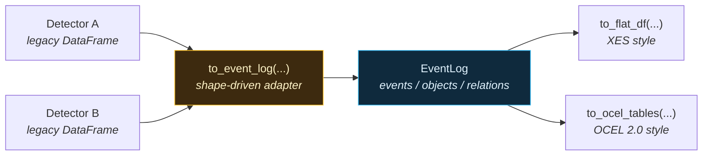

# Event Log: pm4py-shaped output for process mining

Every ts-shape detector returns a pandas DataFrame, but the column names differ between detectors — `systime` vs. `start`/`end`, ad-hoc label columns like `state`, `transition`, `rule_violated`. That makes it hard to feed multiple detectors' output into a single process-mining tool without bespoke glue code.

The `ts_shape.eventlog` package solves this with a **canonical event log** whose column names match the [XES](https://xes-standard.org/) and [OCEL 2.0](https://www.ocel-standard.org/) specs verbatim. ts-shape itself imports no process-mining libraries — the resulting DataFrames can be handed to pm4py / Disco / Celonis / OCEL viewers directly.

---

## At a glance



- One adapter layer normalizes **all 290+** public DataFrame-returning detector methods into the same schema. User-authored detectors via the [Lambda Rules](lambda-rules.md) subsystem flow through the same adapter without any extra plumbing.
- The event log keeps OCEL's separation of **events**, **objects**, and **event-to-object relations** — no single "case" is forced.
- `to_flat_df(case_object_type=...)` defers the case-id question to export time: flatten the same log per asset, per batch, per cycle, etc.

!!! tip "Need a rule without writing a Python class?"
    The [Lambda Rules guide](lambda-rules.md) walks through declaring detectors in YAML. They register dynamically with the same taxonomy and flow through the same adapter described below.

!!! info "Want to see the three-layer flow?"
    [Event Handling — Visual Overview](event-handling-flow.md) has one infographic per archetype (threshold / interval / aggregate / static) showing raw signals → events → rule definition stacked together.

---

## The canonical schema

An :class:`EventLog` holds three pandas DataFrames.

### Events

| Column | Type | Notes |
|---|---|---|
| `ocel:eid` | string | Stable UUIDv5 of `(detector, timestamp, row-key)`. |
| `ocel:activity` | string | Dotted activity label, e.g. `production.machine_state.run`. Aliased to `concept:name` on XES export. |
| `ocel:timestamp` | `datetime64[ns, UTC]` | Event time (interval **end** for intervals). Aliased to `time:timestamp`. |
| `ts_shape:start_timestamp` | `datetime64[ns, UTC]` | Interval start; `NaT` for point events. |
| `ts_shape:duration_s` | float | Interval duration in seconds. |
| `ts_shape:detector` | string | `"ClassName.method_name"` — what produced this event. |
| `ts_shape:pack` | string | One of: `quality`, `production`, `engineering`, `maintenance`, `supplychain`, `energy`, `correlation`. |
| `ts_shape:severity` | string | `info` / `warn` / `critical`, mapped from numeric severity scores. |
| `ts_shape:value` | float | Primary numeric measurement, when applicable. |
| `<pack>:<col>` | various | Detector-specific attributes, prefixed with the pack name. |

### Objects

| Column | Type | Notes |
|---|---|---|
| `ocel:oid` | string | Object id (asset uuid, batch id, serial, ...). |
| `ocel:type` | string | One of the registered object types: `asset`, `cycle`, `batch`, `lot`, `material`, `serial`, `article`, `part`, `work_order`, `shift`, `operator`, `tool`, `recipe`, `station`, `signal`, `sensor` (extensible via `register_object_type`). |

### Relations (event ↔ object)

| Column | Type | Notes |
|---|---|---|
| `ocel:eid` | string | The event. |
| `ocel:oid` | string | The object. |
| `ocel:type` | string | Denormalized for convenience. |
| `ocel:qualifier` | string \| `<NA>` | Role of the object in the event, e.g. `produced_on`, `during_batch`. |

---

## Activity-name taxonomy

The full set of rules is codified in [Event labelling standard](#event-labelling-standard). At a glance:

| Detector method | `ocel:activity` |
|---|---|
| `OutlierDetectionEvents.detect_outliers_zscore` | `quality.outlier.zscore` |
| `StatisticalProcessControlRuleBased.process` | `quality.spc.rule_violation` |
| `MachineStateEvents.detect_run_idle` | `production.machine_state.{state}` |
| `MachineStateEvents.transition_events` | `production.machine_state.transition_{transition}` |
| `SetpointChangeEvents.detect_setpoint_steps` | `engineering.setpoint.step_{change_type}` |
| `DegradationDetectionEvents.detect_trend_degradation` | `maintenance.degradation.trend` |

The full registry lives in `ts_shape.eventlog.taxonomy.REGISTRY` and is enforced by `tests/eventlog/test_adapter_coverage.py` — adding a new detector method without registering a label rule fails CI.

---

## Adapter anatomy

An **adapter** is the function that turns one detector's legacy DataFrame
into a canonical [`EventLog`](#the-canonical-schema). ts-shape ships
*one* generic adapter (`adapters.adapt`) plus a registry of per-method
[`LabelRule`](#the-labelrule-fields) entries that parameterize it. In
practice you almost never write a custom adapter; you add a `LabelRule`
to the registry and the generic adapter does the rest.

### The four shapes

Every detector method is classified into one of four shapes. The shape
tells the generic adapter which legacy columns to look for and how to
populate `ocel:timestamp` / `ts_shape:start_timestamp` /
`ts_shape:duration_s`.

| Shape | When to use it | Time columns probed | Resulting timestamps |
|---|---|---|---|
| `point` | One event per row, single timestamp (e.g. outlier detected at T). | First match in `systime`, `timestamp`, `time`, `event_time`, `ts`, `datetime`, `window_start`, `window_end`, `period_start`, `period_end`, `date`, then any datetime column. | `ocel:timestamp` = the detected time; `ts_shape:start_timestamp` = `NaT`; `ts_shape:duration_s` = `NaN`. |
| `interval` | Each row spans a window with explicit `start` and `end` (e.g. a run/idle interval). | Start: `start` / `window_start` / `period_start`. End: `end` / `window_end` / `period_end`. | `ocel:timestamp` = end; `ts_shape:start_timestamp` = start; `ts_shape:duration_s` = `(end - start).total_seconds()`. Falls back to `point` shape if start/end columns are absent. |
| `summary` | Each row is an aggregate over a window (KPI per shift, daily mean, etc.). | Same as `point`, plus an optional `window_start` / `period_start` / `start` for the bucket beginning. | `ocel:timestamp` = window end; `ts_shape:start_timestamp` = window start (if found); `ts_shape:duration_s` = end − start. |
| `static` | No natural time (e.g. a Gauge R&R summary, a routing-paths table). | None — a fixed `now-UTC` is broadcast to every row. | All rows share the same `ocel:timestamp = now`; `start_timestamp`/`duration_s` are null. |

The shape is declared in the `LabelRule` and lives in
`src/ts_shape/eventlog/taxonomy.py`. The branches that implement each
shape live in `src/ts_shape/eventlog/adapters.py` (function `adapt`).

### The `LabelRule` fields

| Field | Type | Default | What it controls |
|---|---|---|---|
| `template` | `str` | required | The `ocel:activity` value. May contain `{column}` placeholders that get substituted from the legacy row at adapter time. Example: `"production.machine_state.{state}"`. |
| `pack` | `str` | required | One of `quality`, `production`, `engineering`, `maintenance`, `supplychain`, `energy`, `correlation`. Stored as `ts_shape:pack` and used as the prefix for detector-specific attributes. |
| `shape` | `str` | `"point"` | One of `point`, `interval`, `summary`, `static` — see above. |
| `produces_objects` | `tuple[str, ...]` | `("asset",)` | Object types the adapter auto-extracts from standard legacy columns (e.g. `source_uuid → asset`). Empty tuple = events only, no auto-extracted objects. Caller-supplied bindings via `objects=` are honored regardless. |
| `severity_field` | `str \| None` | `None` | Name of a numeric column to bucket into `ts_shape:severity`. Falls back to a `severity` column (passed through verbatim) when omitted. |
| `value_field` | `str \| None` | `None` | Name of the numeric column to expose as `ts_shape:value`. Falls back to `value` / `value_double` / `value_integer` when omitted. |
| `drop_fields` | `tuple[str, ...]` | `()` | Legacy columns to *not* promote to attributes (e.g. internal helper columns). |

### What `to_event_log()` does, step by step

1. Parse the `detector="ClassName.method_name"` string and look up
   `(ClassName, method_name)` in
   `ts_shape.eventlog.taxonomy.REGISTRY`. Missing entry → `KeyError`
   (the coverage test prevents this from ever shipping).
2. Check the `_OVERRIDES` table for a function registered with
   `@register_adapter("ClassName", "method_name")`. If one is
   registered, call it with `(legacy_df, *, rule, detector,
   objects, qualifiers)` and use its return value directly.
3. Otherwise call `adapters.adapt(legacy_df, rule=…, detector=…,
   objects=…, qualifiers=…)`:
    - **Resolve timestamps** based on `rule.shape` (see the four-shapes
      table above).
    - **Render `ocel:activity`** per row by substituting `{column}`
      placeholders in `rule.template` with values from the legacy row.
      Missing columns render as `unknown` (never raise).
    - **Generate stable `ocel:eid`** as
      `"e-" + uuid5(namespace, f"{detector}|{ts.isoformat()}|{i}|{activity}")`.
      Same input → same eid; safe to re-run.
    - **Map severity**: if `rule.severity_field` is set and numeric,
      bucket via `< 3.0 → info`, `3.0–4.5 → warn`, `≥ 4.5 → critical`.
      Falls back to a literal `severity` column when present.
    - **Pull value**: if `rule.value_field` is set, coerce to float and
      expose as `ts_shape:value`. Falls back to `value` /
      `value_double` / `value_integer`.
    - **Prefix attributes**: every legacy column not consumed above is
      added as `<pack>:<col>` so it's namespaced and never clashes with
      OCEL/XES columns.
    - **Auto-extract objects**: for each type in `rule.produces_objects`,
      look for the standard binding column (today: `source_uuid → asset`)
      and create relations. Merge in caller-supplied `objects=` (any
      type allowed; `qualifiers=` provides the role string).
4. Run `schema.validate(...)` on the result — checks required columns,
   dtypes, unique `ocel:eid`, and that every relation references an
   existing event and object.

### Concrete walkthrough — `MachineStateEvents.detect_run_idle`

The legacy DataFrame returned by `detect_run_idle()` looks like this:

| `start` | `end` | `uuid` | `source_uuid` | `is_delta` | `state` | `duration_seconds` |
|---|---|---|---|---|---|---|
| `2026-05-07 08:00:00+00:00` | `2026-05-07 08:04:30+00:00` | `prod:run_idle` | `asset-A` | `False` | `run` | `270.0` |

`to_event_log(legacy_df, detector="MachineStateEvents.detect_run_idle")`
applies the registry entry
`LabelRule(template="production.machine_state.{state}",
pack="production", shape="interval", produces_objects=("asset",))`
and produces:

| Legacy column | Lands in… | Why |
|---|---|---|
| `start` | `ts_shape:start_timestamp` | Interval-shape start probe matched. |
| `end` | `ocel:timestamp` | Interval-shape end probe matched. |
| (computed) | `ts_shape:duration_s = 270.0` | `(end - start).total_seconds()`. |
| `state = "run"` | `ocel:activity = "production.machine_state.run"` | Substituted into `{state}` placeholder. |
| `source_uuid` | `ocel:oid` (in `objects` & `relations`), with `ocel:type = "asset"` | Auto-extracted because `produces_objects` includes `"asset"`. |
| `uuid` | `production:uuid` (event attribute) | Non-canonical column → prefixed and attached. |
| `is_delta` | `production:is_delta` (event attribute) | Same. |
| `duration_seconds` | `production:duration_seconds` (event attribute) | Same. The canonical `ts_shape:duration_s` is always recomputed. |
| (computed) | `ocel:eid = "e-<uuid5>"` | Stable hash of `(detector, timestamp, row-key, activity)`. |
| (constant) | `ts_shape:detector = "MachineStateEvents.detect_run_idle"` | From the `detector=` argument. |
| (constant) | `ts_shape:pack = "production"` | From the `LabelRule`. |

If the caller had passed `objects={"batch": "batch_id"}`, an additional
`batch` object would have been bound from the (caller-provided)
`batch_id` column, with relation qualifier from the `qualifiers={"batch":
"during_batch"}` mapping.

### When to override with a custom adapter

Reach for `@register_adapter` only when the generic adapter cannot
express what your detector returns:

- The legacy DataFrame is irregular (no time column, multiple
  sub-frames, nested dict columns).
- You need to emit **multiple events per legacy row** — e.g. one row
  describes a batch with five sub-stage transitions and you want one
  event per transition.
- You want `produces_objects` to depend on **runtime data** rather than
  on a static rule.
- You need cross-row state (running totals, sessions) that the row-by-row
  generic adapter cannot compute.

In every other case — including new methods on existing detectors —
just add a `LabelRule`. See [Adding a new detector method](#adding-a-new-detector-method).

---

## Event labelling standard

These are the rules every `LabelRule` in
`ts_shape.eventlog.taxonomy.REGISTRY` follows. Adhering to them keeps
the output of any two detectors directly compatible without per-pack
glue code in downstream tools.

### Activity-name format

```
<pack>.<family>.<specifier>[.<subtype>]
```

- All segments **lowercase, snake_case**, separated by `.`.
- `pack` is one of the seven fixed packs (see below).
- `family` is the conceptual category within the pack (e.g. `outlier`,
  `machine_state`, `setpoint`).
- `specifier` distinguishes between methods/algorithms inside the
  family (e.g. `zscore`, `iqr`, `mad` for `quality.outlier`).
- `subtype` is optional and almost always **templated** — a placeholder
  like `{state}` or `{change_type}` substituted from the legacy row.
- Templated segments use `{column_name}` syntax. At adapter time the
  value of that column is dropped in. **Missing values render as
  `unknown` rather than raising.**

### Pack vocabulary (fixed)

| Pack | What belongs here |
|---|---|
| `quality` | Per-measurement quality findings: outliers, SPC violations, tolerance breaches, sensor health. |
| `production` | Shop-floor state and KPIs: machine state, alarms, batches, OEE, traceability, shift reports. |
| `engineering` | Process-engineering analytics: setpoint behavior, control-loop health, steady state, thresholds. |
| `maintenance` | Equipment health: degradation, failure prediction, vibration. |
| `supplychain` | Inventory, demand, lead-time signals. |
| `energy` | Energy consumption, efficiency, carbon intensity, EnPI. |
| `correlation` | Cross-signal analytics that don't naturally belong to one asset (signal correlation, anomaly co-occurrence). |

### Family vocabulary (extensible)

| Pack | Standard families |
|---|---|
| `quality` | `outlier`, `spc`, `tolerance`, `sensor_drift`, `signal`, `data_gap`, `gauge_rr`, `multi_sensor`, `capability`, `distribution`, `anomaly` |
| `production` | `machine_state`, `alarm`, `batch`, `bottleneck`, `changeover`, `cycle_time`, `downtime`, `duty_cycle`, `flow`, `long_downtime`, `micro_stop`, `oee`, `operator`, `order`, `part`, `performance`, `period`, `quality`, `rework`, `routing`, `scrap`, `setup`, `shift`, `target`, `throughput`, `traceability`, `value_trace`, `alignment` |
| `engineering` | `setpoint`, `startup`, `threshold`, `rate_of_change`, `steady_state`, `signal_comparison`, `operating_range`, `thermal`, `process_window`, `control_loop`, `disturbance`, `material_balance`, `stability` |
| `maintenance` | `degradation`, `failure`, `vibration`, `health` |
| `supplychain` | `inventory`, `demand`, `lead_time` |
| `energy` | `consumption`, `efficiency`, `enpi`, `carbon`, `idle` |
| `correlation` | `signal`, `anomaly` |

When a new detector class lands in an existing pack, prefer reusing
one of the families above. Add a new family only when none fits.

### Specifier conventions

Use a **literal specifier** when the method always emits the same
activity:

```python
("OutlierDetectionEvents", "detect_outliers_zscore"):
    LabelRule(template="quality.outlier.zscore", ...)
```

Use a **templated specifier** when one method emits multiple
semantically distinct activities, distinguished by a categorical column:

```python
("MachineStateEvents", "detect_run_idle"):
    LabelRule(template="production.machine_state.{state}", ...)
# emits both production.machine_state.run and production.machine_state.idle
```

Recommended placeholders (use the legacy column name verbatim):

| Placeholder | From column | Examples |
|---|---|---|
| `{state}` | `state` | `run`, `idle`, `setup`, `down` |
| `{transition}` | `transition` | `run_to_idle`, `idle_to_run` |
| `{change_type}` | `change_type` | `step_up`, `step_down`, `ramp` |
| `{phase}` | `phase` | `warmup`, `nominal`, `cooldown` |
| `{anomaly_class}` | `anomaly_class` | `drift`, `flatline`, `oscillation` |

Severity is **never** a templated segment — it lives in
`ts_shape:severity` (see below).

### Attribute-naming rule

| Prefix | Origin | Examples |
|---|---|---|
| `ocel:` | OCEL 2.0 spec | `ocel:eid`, `ocel:activity`, `ocel:timestamp`, `ocel:oid`, `ocel:type`, `ocel:qualifier` |
| `ts_shape:` | ts-shape canonical fields with no OCEL counterpart | `ts_shape:start_timestamp`, `ts_shape:duration_s`, `ts_shape:detector`, `ts_shape:pack`, `ts_shape:severity`, `ts_shape:value` |
| `<pack>:` | Detector-specific legacy columns | `production:state`, `quality:rule_violated`, `engineering:overshoot`, `maintenance:health_score` |
| `concept:`, `time:`, `case:`, `lifecycle:`, `org:` | XES spec — added only by `to_flat_df` | `concept:name`, `time:timestamp`, `case:concept:name`, `lifecycle:transition`, `org:resource` |

The pack prefix prevents any clash between detectors (e.g. two packs
that both use a `state` column become `production:state` and
`quality:state`).

### Severity bucket thresholds

When a `LabelRule` declares a `severity_field`, the numeric value is
bucketed into a string:

| Numeric range | `ts_shape:severity` |
|---|---|
| `< 3.0` | `info` |
| `3.0 ≤ v < 4.5` | `warn` |
| `v ≥ 4.5` | `critical` |
| `NaN` / non-numeric / missing | `<NA>` |

The thresholds match the existing `severity_score` convention used by
`OutlierDetectionEvents`. If a legacy DataFrame already carries a
literal `severity` column with one of `info`/`warn`/`critical`, that
value is passed through verbatim.

### Object-type vocabulary

The 16 standard types in `STANDARD_OBJECT_TYPES`, grouped by what they
represent. Extend with `register_object_type("name")` when none fits.

| Group | Types | Used for |
|---|---|---|
| Physical | `asset`, `tool`, `sensor`, `signal`, `station` | Equipment and instrumentation. `asset` is the default auto-extracted from `source_uuid`. |
| Process | `cycle`, `batch`, `lot`, `recipe`, `work_order`, `shift` | The process context an event happens in. |
| Product | `material`, `part`, `serial`, `article` | What's being made. |
| People | `operator` | The person responsible. |

### Qualifier vocabulary

Recommended values for `ocel:qualifier` (the role of the object in the
event). Free text is permitted, but stick to these for cross-pack
consistency:

| Qualifier | Object type | Meaning |
|---|---|---|
| `produced_on` | `asset` | The event happened on this asset. |
| `during_batch` | `batch` | The event occurred while this batch was running. |
| `during_cycle` | `cycle` | The event occurred during this cycle. |
| `during_shift` | `shift` | The event occurred during this shift. |
| `made_of` | `material` | The product being processed contained this material. |
| `identified_by` | `serial` | The product carries this serial number. |
| `operated_by` | `operator` | The operator on duty. |
| `measured_by` | `sensor` | The sensor producing the reading. |
| `governed_by` | `recipe` | The recipe in effect. |

### Standard attribute extension

In addition to the canonical event columns, every method's `LabelRule`
declares a `standard_attrs` mapping that pins detector-specific values to
a **fixed vocabulary** of attribute keys. This is what makes
cross-detector aggregation possible — two detectors that conceptually
emit the same thing emit it under the same column name.

The full vocabulary (defined in `ts_shape.eventlog.schema.STANDARD_ATTR_KEYS`):

| Key | Type | Used for |
|---|---|---|
| `ts_shape:method` | string | Algorithm name. Always literal. e.g. `"zscore"`, `"iqr"`, `"western_electric_rule_1"`, `"cusum"`. |
| `ts_shape:baseline` | float | Expected / nominal value (SPC centerline, setpoint target, baseline mean). |
| `ts_shape:threshold_low` | float | Lower bound. `NaN` if one-sided. |
| `ts_shape:threshold_high` | float | Upper bound. `NaN` if one-sided. |
| `ts_shape:deviation` | float | Signed `value - baseline`. |
| `ts_shape:deviation_pct` | float | `(value - baseline) / baseline`. |
| `ts_shape:direction` | string | `above` / `below` / `up` / `down` / `outside` / `inside` / `lead` / `lag` / `shift`. |
| `ts_shape:confidence` | float | 0..1, for ML / probabilistic detectors. |
| `ts_shape:sample_count` | int | Number of underlying observations rolled into this row. |
| `ts_shape:outcome` | string | Categorical outcome: `ok` / `nok` / `rework` / `scrap` / `pass` / `fail`, or a normalized reason code. |
| `ts_shape:lifecycle_state` | string | XES-style: `raised` / `cleared` / `predicted` / state names (`run`, `idle`). |
| `ts_shape:lifecycle_pair_id` | string | Pairs raise/clear into a single occurrence. |

Each entry in `standard_attrs` maps a key to either:

* a **legacy column name** (string matching a column in the detector
  output) — the adapter renames it and coerces to the declared type,
* a **literal scalar** (string / float / int) — broadcast to every
  row. This is the common case for `ts_shape:method = "zscore"`.
* `None` — explicitly declares the attribute is not applicable for this
  method (used for archetype-required keys when the detector has no
  natural source).

Example for `OutlierDetectionEvents.detect_outliers_zscore`:

```python
LabelRule(
    template="quality.outlier.zscore",
    pack="quality",
    shape="point",
    severity_field="severity_score",
    standard_attrs={
        "ts_shape:method": "zscore",          # literal — always "zscore"
        "ts_shape:direction": "outside",      # literal
    },
)
```

And for an aggregate KPI like `CycleTimeTracking.cycle_time_statistics`:

```python
LabelRule(
    template="production.cycle_time.statistics",
    pack="production",
    shape="summary",
    standard_attrs={
        "ts_shape:sample_count": "count",     # rename legacy `count` column
    },
)
```

### Required keys per archetype

The coverage test `test_required_standard_attrs_per_archetype` enforces
this mapping at CI time — every method in `REGISTRY` must populate at
least its archetype's required keys.

| Archetype | Required keys | Typical optional keys |
|---|---|---|
| `threshold` | `method`, `direction` | `baseline`, `threshold_low`, `threshold_high`, `deviation`, `deviation_pct`, `confidence` |
| `interval` | `lifecycle_state` | `lifecycle_pair_id`, `sample_count`, `direction` |
| `aggregate` | `sample_count` | `baseline`, `threshold_low`, `threshold_high`, `method` |
| `outcome` | `outcome` | `sample_count`, `method` |
| `static` | `method` | `sample_count`, `baseline`, `threshold_low`, `threshold_high` |
| `trace` | `lifecycle_state`, `direction` | `sample_count` |
| `forecast` | `method`, `confidence` | `baseline`, `threshold_low`, `threshold_high` |
| `correlation` | `method` | `direction`, `confidence`, `sample_count` |

The archetype assignment for every detector method lives in
`ts_shape.eventlog.archetypes.ARCHETYPE_BY_METHOD` and is enforced by
`test_archetype_assignment_is_complete` — every entry in `REGISTRY` has
exactly one archetype.

### Why this matters — cross-detector aggregation

Once every event log emits `ts_shape:method`, `ts_shape:direction`,
`ts_shape:deviation_pct`, `ts_shape:sample_count`, `ts_shape:outcome`,
queries like these become trivial:

```python
# All threshold violations grouped by algorithm.
log.events.groupby("ts_shape:method")["ocel:eid"].count()

# All "above-threshold" events with > 10% deviation.
log.events.query(
    "`ts_shape:direction` == 'above' and `ts_shape:deviation_pct` > 0.10"
)

# Pareto by outcome reason across scrap, rework, NOK.
log.events.groupby("ts_shape:outcome")["ts_shape:sample_count"].sum().sort_values()
```

No per-detector dispatch — the column names are stable across all 264
methods.

### Adding a new detector method

1. Add a `LabelRule` entry to `REGISTRY` in
   `src/ts_shape/eventlog/taxonomy.py`. Pick `pack`, `family`, and
   `specifier` following the conventions above. Pick `shape` based on
   what the method returns (`point` / `interval` / `summary` /
   `static`).
2. If the detector emits multiple activities, use a templated
   specifier (`{column_name}`) and make sure the column is present in
   the legacy DataFrame.
3. If the legacy output uses a non-standard column name for severity
   or value, set `severity_field=` / `value_field=` on the
   `LabelRule`.
4. Classify the method in `ts_shape.eventlog.archetypes.ARCHETYPE_BY_METHOD`
   (one of `threshold`, `interval`, `aggregate`, `outcome`, `static`,
   `trace`, `forecast`, `correlation`). Populate the
   [required `standard_attrs`](#standard-attribute-extension) keys for
   that archetype.
5. Run the coverage test:

    ```bash
    pytest tests/eventlog/test_adapter_coverage.py -q
    ```

    It enforces:

    * every detector method has a rule, and every rule maps to a method
      (no orphans),
    * every key in `standard_attrs` is in the fixed vocabulary,
    * every method has an archetype, and the archetype's required keys
      are populated.
6. If your detector's shape is exotic (multiple events per row,
   nested data, runtime-dependent objects), [register a custom
   adapter](#custom-adapters) instead of fighting the generic one.

---

OCEL is multi-object: an event can be linked to *several* objects of *several* types. ts-shape distinguishes two ways an object ends up on an event:

1. **Auto-extracted** by the adapter from a standard legacy column. Each `LabelRule` declares `produces_objects` (e.g. `("asset",)`); when the legacy DataFrame contains the matching column (e.g. `source_uuid`), the asset object is created automatically.
2. **Caller-supplied** via the `objects=` argument. This is for *contextual* annotations — "this outlier happened during batch B-2026-117 on shift A". Caller-supplied bindings can use any object type.

```python
to_event_log(
    legacy_df,
    detector="OutlierDetectionEvents.detect_outliers_zscore",
    objects={
        "batch":    "batch_id",                 # column name
        "operator": lambda r: r["op_id"][:6],   # callable
        "shift":    "A",                        # scalar broadcast
    },
    qualifiers={"asset": "produced_on", "batch": "during_batch"},
)
```

If a method has no natural object association at all (e.g. a global cross-signal correlation statistic), the adapter declares `produces_objects = ()` and the resulting `EventLog` has empty `objects` and `relations` tables. Calling `to_flat_df(...)` on such a log raises a clear error rather than fabricating object ids.

---

## Quick start

```python
from ts_shape.events.production.machine_state import MachineStateEvents
from ts_shape.events.quality.outlier_detection import OutlierDetectionEvents
from ts_shape.eventlog import to_event_log, concat, to_flat_df, to_ocel_tables

# 1. Run two detectors on the same input.
state_legacy = MachineStateEvents(df, run_state_uuid="asset-A").detect_run_idle()
outlier_legacy = OutlierDetectionEvents(df2, value_column="torque").detect_outliers_zscore()

# 2. Normalize each into a canonical EventLog.
state_log = to_event_log(state_legacy, detector="MachineStateEvents.detect_run_idle")
outlier_log = to_event_log(
    outlier_legacy,
    detector="OutlierDetectionEvents.detect_outliers_zscore",
    objects={"batch": "batch_id"},
)

# 3. Combine; sorted by timestamp, objects deduped.
log = concat(state_log, outlier_log)

# 4a. Flatten for XES tools (pm4py, Disco, Celonis).
xes_df = to_flat_df(log, case_object_type="asset")
# Now xes_df has case:concept:name / concept:name / time:timestamp columns.

# 4b. Or hand the OCEL tables to pm4py directly.
events_df, objects_df, relations_df = to_ocel_tables(log)
# import pm4py; pm4py.write_ocel2_json(...)
```

---

## Interval encoding

OCEL events have a single timestamp; XES traces care about start/complete pairs. The canonical event log keeps **one row per event** with `ocel:timestamp` = interval end and `ts_shape:start_timestamp` = interval start. The XES exporter then offers two lifecycle modes:

- `lifecycle="single"` (default): one row, `lifecycle:transition="complete"`.
- `lifecycle="two_row"`: expands intervals into a `start` row + `complete` row, paired by `concept:instance` for strict XES-compliance.

```python
xes_complete_only = to_flat_df(log, case_object_type="asset", lifecycle="single")
xes_with_starts = to_flat_df(log, case_object_type="asset", lifecycle="two_row")
```

---

## Custom adapters

For the rare detector whose output doesn't fit any of the four shapes
(see [When to override](#when-to-override-with-a-custom-adapter)),
register an override with `@register_adapter`. The normalizer consults
the override **before** the generic adapter and validates the result
the same way.

### Adapter signature

```python
def my_adapter(
    legacy_df: pd.DataFrame,
    *,
    rule: LabelRule,            # the registry entry for this method
    detector: str,              # "MyDetector.weird_method"
    objects:    Mapping[str, object] | None,
    qualifiers: Mapping[str, str] | None,
) -> EventLog: ...
```

### Invariants the override must satisfy

- `events` has the columns listed in the [Events table](#events): at
  minimum `ocel:eid` (unique), `ocel:activity`, `ocel:timestamp`,
  `ts_shape:detector`, `ts_shape:pack`.
- Every `ocel:eid` referenced from `relations` exists in `events`.
- Every `(ocel:oid, ocel:type)` pair in `relations` exists in `objects`.

`to_event_log()` runs `schema.validate(...)` on the returned
`EventLog`, so violations surface immediately.

### Working example

```python
import pandas as pd
from ts_shape.eventlog import EventLog, register_adapter
from ts_shape.eventlog import schema as S
from ts_shape.eventlog.taxonomy import REGISTRY, LabelRule

# 1. Make the registry aware of the method (real detectors do this in
#    src/ts_shape/eventlog/taxonomy.py — done inline here for brevity).
REGISTRY[("MyDetector", "weird_method")] = LabelRule(
    template="production.custom.{kind}",
    pack="production",
    shape="point",
    produces_objects=("asset",),
)

# 2. Register an override that emits TWO events per legacy row
#    (one "raised", one "cleared") — something the generic adapter
#    cannot express.
@register_adapter("MyDetector", "weird_method")
def expand_pairs(legacy_df, *, rule, detector, objects, qualifiers):
    rows: list[dict] = []
    relations: list[dict] = []
    for i, row in legacy_df.iterrows():
        for kind in ("raised", "cleared"):
            eid = f"e-{detector}-{i}-{kind}"
            rows.append({
                S.OCEL_EID: eid,
                S.OCEL_ACTIVITY: f"production.custom.{kind}",
                S.OCEL_TIMESTAMP: pd.Timestamp(row[f"{kind}_at"], tz="UTC"),
                S.TS_DETECTOR: detector,
                S.TS_PACK: rule.pack,
            })
            relations.append({
                S.OCEL_EID: eid,
                S.OCEL_OID: row["asset_id"],
                S.OCEL_TYPE: "asset",
                S.OCEL_QUALIFIER: "produced_on",
            })
    events = pd.concat([S.empty_events(), pd.DataFrame(rows)], ignore_index=True)
    rels = pd.concat([S.empty_relations(), pd.DataFrame(relations)], ignore_index=True)
    objs = pd.DataFrame({
        S.OCEL_OID: legacy_df["asset_id"].astype("string").unique(),
        S.OCEL_TYPE: "asset",
    })
    return EventLog(events=events, objects=objs, relations=rels)
```

Once registered, `to_event_log(df, detector="MyDetector.weird_method")`
calls the override automatically.

---

## What ts-shape does *not* do

The package writes no XES files, no OCEL JSON, no SQLite — those are pm4py's job. ts-shape's responsibility ends at producing DataFrames whose column names match the specs. This keeps the dependency footprint small and lets users pick whichever process-mining stack they prefer.

A worked end-to-end example (with output) is in [examples/eventlog](../examples/eventlog.md).
