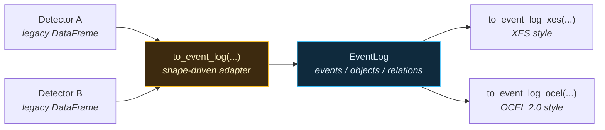

# Event Log: pm4py-shaped output for process mining

Every ts-shape detector returns a pandas DataFrame in one of three canonical shapes — `point` (`systime`), `interval` (`start` / `end` / `duration_seconds`), or `summary` (windowed aggregates with the same `start` / `end`). The shape is enforced by `src/ts_shape/events/_output.py`. Detector-specific labels (`state`, `transition`, `rule_violated`, …) live alongside the canonical columns.

The `ts_shape.eventlog` package goes one step further with a **canonical event log** whose column names match the [XES](https://xes-standard.org/) and [OCEL 2.0](https://www.ocel-standard.org/) specs verbatim. ts-shape itself imports no process-mining libraries — the resulting DataFrames can be handed to pm4py / Disco / Celonis / OCEL viewers directly.

!!! abstract "On this page vs. the rest of the Event Log guide"
    - **This page** — the canonical schema, quick start, and export modes.
    - **[Labelling standard & taxonomy](taxonomy.md)** — the activity-name rules, pack/family vocabularies, severity buckets, and standard attributes that make any two detectors compatible.
    - **[Adapter anatomy & custom adapters](adapters.md)** — how a detector's raw DataFrame becomes an `EventLog`, and how to override it.

---

## At a glance



- One adapter layer normalizes **all 290+** public DataFrame-returning detector methods into the same schema. User-authored detectors via the [Lambda Rules](../lambda-rules.md) subsystem flow through the same adapter without any extra plumbing.
- The event log keeps OCEL's separation of **events**, **objects**, and **event-to-object relations** — no single "case" is forced.
- `to_event_log_xes(case_object_type=...)` defers the case-id question to export time: flatten the same log per asset, per batch, per cycle, etc.

!!! tip "Need a rule without writing a Python class?"
    The [Lambda Rules guide](../lambda-rules.md) walks through declaring detectors in YAML. They register dynamically with the same taxonomy and flow through the same adapter described in [Adapter anatomy](adapters.md).

!!! info "Want to see the three-layer flow?"
    [Event Handling — Visual Overview](../event-handling-flow.md) has one infographic per archetype (threshold / interval / aggregate / static) showing raw signals → events → rule definition stacked together.

---

## The canonical schema

An :class:`EventLog` holds the five OCEL 2.0 relational tables as pandas
DataFrames: `events`, `objects`, `relations` (event-to-object), `o2o`
(object-to-object), and `object_changes` (time-varying object attributes). The
last two are empty unless supplied — see [Object relations &
attributes](#object-relations-and-attributes).

### Events

| Column | Type | Notes |
|---|---|---|
| `ocel:eid` | string | Stable UUIDv5 of `(detector, timestamp, row-key)`. |
| `ocel:activity` | string | Dotted activity label, e.g. `production.machine_state.run`. Aliased to `concept:name` on XES export. |
| `ocel:timestamp` | `datetime64[ns, UTC]` | Event time (interval **end** for intervals). Aliased to `time:timestamp`. |
| `ts_shape:start_timestamp` | `datetime64[ns, UTC]` | Interval start; `NaT` for point events. |
| `ts_shape:duration_s` | float | Interval duration in seconds. |
| `ts_shape:detector` | string | `"ClassName.method_name"` — what produced this event. |
| `ts_shape:pack` | string | One of: `quality`, `production`, `engineering`, `maintenance`, `supplychain`, `energy`, `correlation`, `development`. |
| `ts_shape:severity` | string | `info` / `warn` / `critical`, mapped from numeric severity scores. |
| `ts_shape:value` | float | Primary numeric measurement, when applicable. |
| `<pack>:<col>` | various | Detector-specific attributes, prefixed with the pack name. |

The **9 canonical core columns** above (`ocel:eid` … `ts_shape:value`) are
**always present** on every events table, regardless of detector or shape — so
every event log shares an identical core schema and frames line up when
appended. Everything beyond them — the [standard-attr extensions](taxonomy.md#standard-attribute-extension)
(`ts_shape:method`, `ts_shape:lifecycle_state`, …) and the `<pack>:<col>`
passthroughs — is a per-detector **extra**, emitted only when it actually
carries a value. An all-empty extra column is dropped rather than shipped full
of `NaN`, so different detectors produce different *extra* columns.

To append per-detector logs, use `concat(...)`, which unions columns across
inputs and fills gaps with `NaN` (so appending never fails). If you need every
*individual* frame to expose the identical full column set **before** appending
or stacking them yourself, call `align_columns(*logs)` — it reindexes each
log's events table to the shared union (core first, extras sorted), leaving
`objects` / `relations` untouched.

### Objects

| Column | Type | Notes |
|---|---|---|
| `ocel:oid` | string | Object id (asset uuid, batch id, serial, ...). |
| `ocel:type` | string | One of the registered object types: `asset`, `cycle`, `batch`, `lot`, `material`, `serial`, `article`, `part`, `work_order`, `shift`, `operator`, `tool`, `recipe`, `station`, `signal`, `sensor` (extensible via `register_object_type`). |

### Relations (event ↔ object)

| Column | Type | Notes |
|---|---|---|
| `ocel:eid` | string | The event. |
| `ocel:oid` | string | The object. |
| `ocel:type` | string | Denormalized for convenience. |
| `ocel:qualifier` | string \| `<NA>` | Role of the object in the event, e.g. `produced_on`, `during_batch`. |

### O2O — object-to-object relations

OCEL 2.0 also models qualified relations *between* objects (a `part` belongs to
a `batch`, a `sensor` is mounted on an `asset`). Empty unless supplied.

| Column | Type | Notes |
|---|---|---|
| `ocel:oid` | string | Source object. |
| `ocel:oid_2` | string | Target object. |
| `ocel:qualifier` | string | Role of the target relative to the source, e.g. `part_of`. |

### Object changes — time-varying attributes

OCEL 2.0 lets an object's attributes change over time. Empty unless supplied.

| Column | Type | Notes |
|---|---|---|
| `ocel:oid` | string | The object. |
| `ocel:type` | string | Its type. |
| `ocel:field` | string | Attribute name, e.g. `firmware`. |
| `ocel:value` | any | Value taken from `ocel:timestamp` onward. |
| `ocel:timestamp` | `datetime64[ns, UTC]` | When the value became effective. |

The activity-name taxonomy that fills `ocel:activity`, plus the full pack /
family / severity / standard-attribute rules, are documented in
[Labelling standard & taxonomy](taxonomy.md). How a detector's raw DataFrame is
turned into this schema is covered in [Adapter anatomy](adapters.md).

---

## Quick start

```python
from ts_shape.events.production.machine_state import MachineStateEvents
from ts_shape.events.quality.outlier_detection import OutlierDetectionEvents
from ts_shape.eventlog import to_event_log, concat, to_event_log_xes, to_event_log_ocel

# 1. Run two detectors on the same input.
state_legacy = MachineStateEvents(df, run_state_uuid="asset-A").detect_run_idle()
outlier_legacy = OutlierDetectionEvents(df2, value_column="torque").detect_outliers_zscore()

# 2. Normalize each into a canonical EventLog.
state_log = to_event_log(state_legacy, detector="MachineStateEvents.detect_run_idle")
outlier_log = to_event_log(
    outlier_legacy,
    detector="OutlierDetectionEvents.detect_outliers_zscore",
    objects={"batch": "batch_id"},
)

# 3. Combine; sorted by timestamp, objects deduped.
log = concat(state_log, outlier_log)

# 4a. Flatten for XES tools (pm4py, Disco, Celonis).
xes_df = to_event_log_xes(log, case_object_type="asset")
# Now xes_df has case:concept:name / concept:name / time:timestamp columns.

# 4b. Or hand the OCEL 2.0 tables to pm4py directly.
tables = to_event_log_ocel(log)
# tables.events / .objects / .relations / .o2o / .object_changes — these map
# 1:1 onto pm4py's OCEL(...) constructor. import pm4py; pm4py.write_ocel2_json(...)
```

---

## Object relations and attributes

OCEL is multi-object: an event can be linked to *several* objects of *several* types. ts-shape distinguishes two ways an object ends up on an event:

1. **Auto-extracted** by the adapter from a standard legacy column. Each `LabelRule` declares `produces_objects` (e.g. `("asset",)`); when the legacy DataFrame contains the matching column (e.g. `source_uuid`), the asset object is created automatically.
2. **Caller-supplied** via the `objects=` argument. This is for *contextual* annotations — "this outlier happened during batch B-2026-117 on shift A". Caller-supplied bindings can use any object type.

A binding value is one of: a **column name** (string), a **callable** `row -> oid`, a **`pd.Series`** aligned with the detector output, or a **non-string scalar** broadcast to every row. A bare string is always read as a column name — for a constant id use a callable.

```python
to_event_log(
    legacy_df,
    detector="OutlierDetectionEvents.detect_outliers_zscore",
    objects={
        "batch":    "batch_id",                 # column name
        "operator": lambda r: r["op_id"][:6],   # callable
        "shift":    lambda r: "A",              # constant id (callable, not "A")
    },
    qualifiers={"asset": "produced_on", "batch": "during_batch"},
)
```

If a method has no natural object association at all (e.g. a global cross-signal correlation statistic), the adapter declares `produces_objects = ()` and the resulting `EventLog` has empty `objects` and `relations` tables. Calling `to_event_log_xes(...)` on such a log raises a clear error rather than fabricating object ids.

### O2O relations and object changes

Pass `o2o=` and `object_changes=` to attach the two remaining OCEL 2.0 tables. Each accepts a DataFrame or an iterable of dict rows with the canonical columns; every referenced `ocel:oid` must exist in `objects` or `validate` raises.

```python
to_event_log(
    legacy_df,
    detector="OutlierDetectionEvents.detect_outliers_zscore",
    objects={"asset": "source_uuid", "station": lambda r: "line-1"},
    o2o=[{"ocel:oid": "asset-A", "ocel:oid_2": "line-1", "ocel:qualifier": "part_of"}],
    object_changes=[{
        "ocel:oid": "asset-A", "ocel:type": "asset",
        "ocel:field": "firmware", "ocel:value": "v2",
        "ocel:timestamp": "2026-05-07T00:00:00Z",
    }],
)
```

### Resources (`org:resource`)

In the XES export, `org:resource` is the **operator that performed the activity** — not the case object. It is populated only from an `operator`-type relation (bind one via `objects={"operator": ...}`) and is otherwise omitted; ts-shape never copies the case id into it.

---

## Interval encoding

OCEL events have a single timestamp; XES traces care about start/complete pairs. The canonical event log keeps **one row per event** with `ocel:timestamp` = interval end and `ts_shape:start_timestamp` = interval start. The XES exporter then offers two lifecycle modes:

- `lifecycle="single"` (default): one row, `lifecycle:transition="complete"`.
- `lifecycle="two_row"`: expands intervals into a `start` row + `complete` row, paired by `concept:instance` for strict XES-compliance.

```python
xes_complete_only = to_event_log_xes(log, case_object_type="asset", lifecycle="single")
xes_with_starts = to_event_log_xes(log, case_object_type="asset", lifecycle="two_row")
```

---

## What ts-shape does *not* do

The package writes no XES files, no OCEL JSON, no SQLite — those are pm4py's job. ts-shape's responsibility ends at producing DataFrames whose column names match the specs. This keeps the dependency footprint small and lets users pick whichever process-mining stack they prefer.

A worked end-to-end example (with output) is in [examples/eventlog](../../examples/eventlog.md).
