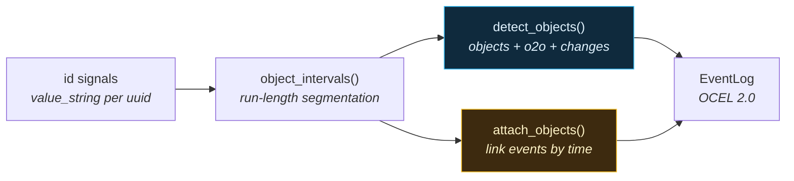

# Object Detection: batches, serials, coils, recipes…

The event packs answer *"what happened?"*. This layer answers *"to which **things**?"* —
the batch, product, material, coil, serial, bundle, customer part-number, family,
drum, tool, and recipe objects that events refer to. It is one **generic, declarative
layer**, not another family of detectors: you describe which signals carry which
object type, and the same run-length kernel that powers batch/traceability detection
([`SegmentExtractor`](../../reference/index.md)) extracts every object's presence
interval into the OCEL 2.0 [`objects` / `o2o` / `object_changes`](index.md#the-canonical-schema)
tables. **New object types are added by data/config — never by writing code.**



## Declare the objects

An `ObjectSpec` maps one signal to one object type. The `object_type` is
auto-registered if it is not one of the standard 16, so `coil`, `drum`, `bundle`,
`family`, `customer_partnumber`, … work out of the box.

```python
from ts_shape.eventlog import ObjectSpec, detect_objects

specs = [
    ObjectSpec("sig:batch",  "batch",  id_template="{type}:{value}"),
    ObjectSpec("sig:serial", "serial", id_template="{type}:{value}"),
    ObjectSpec("sig:coil",   "coil",   id_template="{type}:{value}"),   # auto-registered
]
```

| Field | Purpose |
|---|---|
| `uuid` | The signal whose value column carries the object id. |
| `object_type` | OCEL type; auto-registered if unknown. |
| `value_column` | `value_string` (default) or `value_integer`. |
| `min_duration` | Drop presence blips shorter than this. |
| `id_template` | Render the oid — `"{value}"` or `"{type}:{value}"` to namespace. |
| `attributes` | `{attr_name: signal_uuid}` captured into `object_changes`. |

At scale, skip the hand-written list entirely — tag object types in your signal
metadata and derive the specs:

```python
from ts_shape.eventlog import object_specs_from_metadata

specs = object_specs_from_metadata(metadata_loader.to_df())  # reads `object_type` tags
```

## Detect objects and their relations

```python
log = detect_objects(df, specs)        # an EventLog with NO events
log.objects          # one row per (oid, type)
log.o2o              # serial part_of batch, etc. — inferred from interval overlap
log.object_changes   # presence lifecycle (active/released) + captured attributes
```

Object-to-object relations come from interval overlap: when one object's presence
interval sits wholly inside another's, the inner is `part_of` the outer (a serial
inside a batch); otherwise overlapping objects are `co_active`.

## Attach objects to any event log

This is the end-to-end win. `attach_objects` links the output of **any** event
detector to the detected objects by temporal containment — every event gets E2O
relations to whatever batch / serial / coil was active at its timestamp, with **zero
per-detector changes**.

```python
from ts_shape.eventlog import attach_objects, to_event_log

ev_log = to_event_log(intervals, detector="MachineStateEvents.detect_run_idle")

enriched = attach_objects(
    ev_log, df, specs,
    qualifiers={"batch": "during_batch", "serial": "identified_by", "coil": "made_of"},
)
# enriched.relations now links each run/idle event to its batch, serial and coil.
```

Because `detect_objects` returns a normal `EventLog`, you can also
[`concat`](index.md) an objects-only log with any event log instead of attaching by
time. Either way the result exports through `to_event_log_ocel` /
`to_event_log_xes` like any other log.

A full runnable walkthrough is in
[`examples/object_detection_demo.py`](https://github.com/ts-shape/ts-shape/blob/main/examples/object_detection_demo.py).

## See also

- [Event Log overview](index.md) — the five OCEL 2.0 tables.
- [Labelling standard & taxonomy](taxonomy.md) — the object-type vocabulary.
