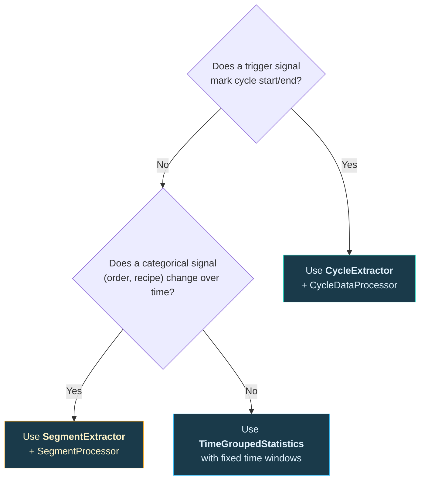

# Feature Extraction

Extract meaningful features from raw timeseries by cutting data into repeatable units (cycles or segments), then computing statistical profiles per unit.

---

## When to Use What

Manufacturing processes fall into two categories. Choose the cutting method that matches your process type:

| Process Type | Example | Cutting Method | Class |
|---|---|---|---|
| **Discrete / Part-based** | CNC machining, injection molding, press cycles | **Cycles** — boolean or step triggers define start/end | `CycleExtractor` + `CycleDataProcessor` |
| **Continuous / Order-based** | Coating lines, extrusion, chemical batches | **Segments** — a categorical signal (order/part number) changes over time | `SegmentExtractor` + `SegmentProcessor` |

After cutting, both paths converge on the same goal: **compute a feature table** with statistical metrics per UUID per unit.

```mermaid
flowchart LR
    RAW["Raw Timeseries<br/><i>systime, uuid, value_double</i>"]

    subgraph CUT["<b>Cut into Units</b>"]
        direction TB
        CYC["CycleExtractor<br/><i>discrete parts</i>"]
        SEG["SegmentExtractor<br/><i>continuous orders</i>"]
    end

    subgraph APPLY["<b>Apply to Process Data</b>"]
        direction TB
        CDP["CycleDataProcessor<br/><i>split_by_cycle</i>"]
        SP["SegmentProcessor<br/><i>apply_ranges</i>"]
    end

    subgraph FEAT["<b>Feature Table</b>"]
        direction TB
        F1["DescriptiveFeatures<br/><i>per-UUID grouped stats</i>"]
        F2["SegmentProcessor<br/><i>compute_metric_profiles</i>"]
        F3["NumericStatistics<br/><i>summary_as_dict</i>"]
    end

    subgraph COMPARE["<b>Compare</b>"]
        direction TB
        PC["ProfileComparison<br/><i>distance, cluster, anomaly</i>"]
    end

    RAW --> CUT --> APPLY --> FEAT --> COMPARE

    style CUT fill:#1a3a4a,stroke:#2dd4bf,color:#e0f2fe
    style APPLY fill:#1a3a4a,stroke:#f59e0b,color:#fef3c7
    style FEAT fill:#1a3a4a,stroke:#38bdf8,color:#e0f2fe
    style COMPARE fill:#1a3a4a,stroke:#ef4444,color:#fecaca
```



---

## Path A: Cycles (Discrete / Part-based Processes)

Use this when your machine produces individual parts and a trigger signal marks the start and end of each cycle.

### Step 1 — Extract cycles

```python
from ts_shape.features.cycles.cycles_extractor import CycleExtractor

extractor = CycleExtractor(
    dataframe=df,
    start_uuid="cycle_trigger",
)

# Choose the method that matches your trigger type
cycles = extractor.process_persistent_cycle()   # boolean: True = in cycle
# cycles = extractor.process_trigger_cycle()    # boolean: True→False = cycle end
# cycles = extractor.process_step_sequence(start_step=1, end_step=10)  # integer steps
# cycles = extractor.process_value_change_cycle()  # any value change = new cycle

# Validate: drop cycles that are too short or too long
cycles = extractor.validate_cycles(cycles, min_duration='5s', max_duration='10m')

# Check extraction quality
stats = extractor.get_extraction_stats()
print(f"Total: {stats['total_cycles']}, Complete: {stats['complete_cycles']}")
```

**Output:** DataFrame with `cycle_start`, `cycle_end`, `cycle_uuid`, `is_complete`.

### Step 2 — Apply cycles to process data

```python
from ts_shape.features.cycles.cycle_processor import CycleDataProcessor

processor = CycleDataProcessor(
    cycles_df=cycles,
    values_df=process_data,   # DataFrame with all process parameter UUIDs
)

# Option A: Get a dict of DataFrames, one per cycle
cycle_dict = processor.split_by_cycle()
# cycle_dict["<cycle_uuid>"] → DataFrame for that cycle

# Option B: Annotate the full DataFrame with cycle_uuid
merged = processor.merge_dataframes_by_cycle()
# merged now has a 'cycle_uuid' column on every row
```

### Step 3 — Build feature table

```python
from ts_shape.features.stats.numeric_stats import NumericStatistics
from ts_shape.features.stats.feature_table import DescriptiveFeatures
import pandas as pd

# Option A: Full descriptive features grouped by UUID (per cycle)
# Note: DescriptiveFeatures expects the standard schema columns
# (systime, uuid, is_delta, value_double, etc.) in the input DataFrame.
results = []
for cycle_uuid, cycle_df in cycle_dict.items():
    features = DescriptiveFeatures(cycle_df)
    stats = features.compute(output_format='dict')
    for uuid_val, uuid_stats in stats.items():
        row = {'cycle_uuid': cycle_uuid, 'uuid': uuid_val}
        # Flatten numeric stats (guard against missing columns)
        if isinstance(uuid_stats, dict):
            for col_stats in uuid_stats.values():
                if isinstance(col_stats, dict) and 'numeric_stats' in col_stats:
                    row.update(col_stats['numeric_stats'])
        results.append(row)

feature_table = pd.DataFrame(results)
print(feature_table.head())
# cycle_uuid | uuid        | mean  | std  | min  | max  | ...
# abc-123    | temperature | 52.1  | 1.8  | 48.3 | 55.9 | ...
# abc-123    | pressure    | 101.2 | 4.7  | 91.0 | 112.4| ...

# Option B: Quick per-signal summary using NumericStatistics directly
for cycle_uuid, cycle_df in cycle_dict.items():
    temp_df = cycle_df[cycle_df['uuid'] == 'temperature']
    stats = NumericStatistics.summary_as_dict(temp_df, 'value_double')
    print(f"Cycle {cycle_uuid[:8]}: mean={stats['mean']:.1f}, std={stats['std']:.2f}")
```

---

## Path B: Segments (Continuous / Order-based Processes)

Use this when your machine runs continuously and a categorical signal (order number, part number, recipe) indicates what is being produced at any point in time.

### Step 1 — Extract time ranges from the order signal

```python
from ts_shape.features.segment_analysis.segment_extractor import SegmentExtractor

# The 'order_number' UUID holds values like "Order-A", "Order-B", etc.
ranges = SegmentExtractor.extract_time_ranges(
    dataframe=df,
    segment_uuid='order_number',          # UUID of the categorical signal
    value_column='value_string',           # or 'value_integer' for numeric IDs
    min_duration='30s',                    # drop short transitional segments
)

print(ranges)
# segment_value | segment_start       | segment_end         | segment_duration | segment_index
# Order-A       | 2024-01-01 00:00:00 | 2024-01-01 01:30:00 | 01:30:00         | 0
# Order-B       | 2024-01-01 01:30:01 | 2024-01-01 03:00:00 | 01:29:59         | 1
# Order-A       | 2024-01-01 03:00:01 | 2024-01-01 04:30:00 | 01:29:59         | 2
```

### Step 2 — Apply ranges to process parameters

```python
from ts_shape.features.segment_analysis.segment_processor import SegmentProcessor

# Filter process data to only the time ranges and annotate with segment info
segmented = SegmentProcessor.apply_ranges(
    dataframe=df,
    time_ranges=ranges,
    target_uuids=['temperature', 'pressure', 'speed'],  # process parameter UUIDs
)

# Every row now has 'segment_value' (e.g. "Order-A") and 'segment_index' (0, 1, 2)
print(segmented[['systime', 'uuid', 'value_double', 'segment_value']].head())
```

### Step 3 — Build feature table

```python
# Compute 19 statistical metrics per UUID per order
profiles = SegmentProcessor.compute_metric_profiles(
    segmented,
    group_column='segment_value',   # aggregate all runs of same order
    # group_column='segment_index', # or treat each run individually
)

print(profiles)
# uuid        | segment_value | sample_count | mean  | std  | min  | max  | kurtosis | ...
# temperature | Order-A       | 200          | 50.1  | 1.9  | 45.3 | 55.2 | -0.12    | ...
# temperature | Order-B       | 100          | 80.3  | 2.1  | 75.1 | 85.7 | 0.05     | ...
# pressure    | Order-A       | 200          | 100.4 | 4.8  | 88.2 | 113.1| -0.08    | ...
# ...

# Select specific metrics only
profiles_slim = SegmentProcessor.compute_metric_profiles(
    segmented,
    metrics=['mean', 'std', 'min', 'max', 'skewness', 'kurtosis'],
)
```

### Step 4 — Compare orders or parameters (optional)

```python
from ts_shape.features.segment_analysis.profile_comparison import ProfileComparison

# Compare orders: how different is Order-A from Order-B?
order_dm = ProfileComparison.compute_distance_matrix(
    profiles, group_column='segment_value'
)
print(order_dm)
#          Order-A  Order-B
# Order-A     0.00     3.42
# Order-B     3.42     0.00

# Compare UUIDs: which parameters behave similarly?
uuid_dm = ProfileComparison.compute_distance_matrix(
    profiles, group_column='uuid'
)

# Cluster parameters by similarity
clusters = ProfileComparison.cluster(uuid_dm, n_clusters=2)
print(clusters)
# label       | cluster
# temperature | 1
# pressure    | 1
# speed       | 2

# Find which parameters changed most between orders
profiles_by_run = SegmentProcessor.compute_metric_profiles(
    segmented, group_column='segment_index'
)
changes = ProfileComparison.detect_changes(profiles_by_run)
print(changes.sort_values('change_score', ascending=False).head())
# uuid        | segment_index | change_score
# temperature | 1             | 4.82          ← big shift when order changed
# pressure    | 1             | 4.15
# speed       | 1             | 0.03          ← speed stayed constant
```

---

## Available Metrics

Both `DescriptiveFeatures` and `SegmentProcessor.compute_metric_profiles` produce metrics from `NumericStatistics.summary_as_dict()`:

| Metric | Description |
|---|---|
| `mean` | Arithmetic mean |
| `median` | 50th percentile |
| `std` | Standard deviation |
| `var` | Variance |
| `min` / `max` | Extremes |
| `sum` | Total sum |
| `range` | max - min |
| `q1` / `q3` | 25th / 75th percentile |
| `iqr` | Interquartile range (q3 - q1) |
| `percentile_10` / `percentile_90` | 10th / 90th percentile |
| `skewness` | Distribution asymmetry |
| `kurtosis` | Distribution tail weight |
| `mad` | Mean absolute deviation |
| `coeff_var` | Coefficient of variation (std / mean) |
| `sem` | Standard error of the mean |
| `mode` | Most frequent value |

---

## Decision Guide



---

## Next Steps

- [Quality Control & SPC](quality.md) — Apply outlier detection and control charts to your feature table
- [Production Monitoring](production.md) — Machine states, OEE, and downtime analysis
- [Process Engineering](engineering.md) — Setpoint tracking and process stability
- [Pipeline](pipeline-builder.md) — Chain the entire workflow into a single reusable `Pipeline`
- [API Reference](../reference/index.md) — Full class and method documentation
