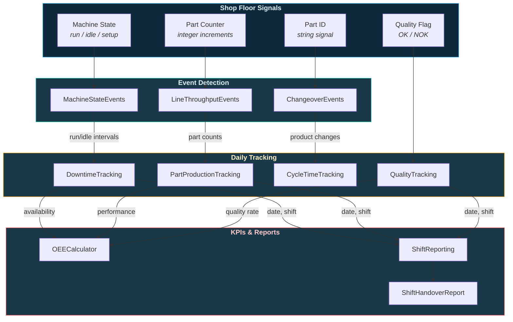

# Guides

From raw signals to production KPIs — follow the data through the plant.

---

## Plant Data Pipeline

Every manufacturing analysis follows the same flow. ts-shape mirrors this with dedicated modules at each stage.

---

## Guide Index

Pick the stage that matches where you are in your analysis.

-   :material-database-import:{ .lg .middle } **[Data Acquisition](loading.md)**

    ---

    Connect to historians, data lakes, and metadata stores. Load Parquet, S3, Azure Blob, or TimescaleDB into DataFrames.

    `ParquetLoader` | `AzureBlobParquetLoader` | `S3ProxyParquetLoader` | `MetadataLoader` | `DataIntegratorHybrid`

-   :material-filter-variant:{ .lg .middle } **[Signal Conditioning](transforms.md)**

    ---

    Clean and prepare raw signals. Filter by range, time window, pattern, or boolean flag. Convert timezones and compute derived values.

    `NumericFilter` | `DateTimeFilter` | `StringFilter` | `TimezoneShift` | `NumericCalc`

-   :material-table-pivot:{ .lg .middle } **[Feature Extraction](feature-extraction.md)**

    ---

    Cut timeseries into repeatable units (cycles or segments), then build feature tables with statistical profiles per unit. Discrete parts or continuous orders.

    `CycleExtractor` | `SegmentExtractor` | `SegmentProcessor` | `DescriptiveFeatures` | `ProfileComparison`

-   :material-pipe:{ .lg .middle } **[Pipeline Builder](pipeline-builder.md)**

    ---

    Chain any ts-shape class into a single reproducible pipeline. Understand `add_step` vs `add_instance_step`, wire DataFrames with sentinels, and debug with `describe()` and `run_steps()`.

    `FeaturePipeline` | `add_step` | `add_instance_step` | `$prev` | `$input`

-   :material-chart-bell-curve-cumulative:{ .lg .middle } **[Signal Analytics](statistics.md)**

    ---

    Compute descriptive statistics, extract process cycles, and detect patterns across signals.

    `NumericStatistics` | `TimestampStatistics` | `CycleExtractor` | `PatternRecognition`

-   :material-shield-check:{ .lg .middle } **[Quality Control & SPC](quality.md)**

    ---

    Outlier detection (Z-score, IQR, MAD, IsolationForest), Western Electric Rules, CUSUM shifts, and Cp/Cpk capability indices.

    `OutlierDetection` | `StatisticalProcessControl` | `ToleranceDeviation`

-   :material-factory:{ .lg .middle } **[Production Monitoring](production.md)**

    ---

    Machine states, line throughput, changeovers, downtime, cycle times, shift reporting, and quality tracking on the shop floor.

    `MachineStateEvents` | `DowntimeTracking` | `ShiftReporting` | `CycleTimeTracking` | +5 more

-   :material-gauge:{ .lg .middle } **[OEE & Plant Analytics](oee-analytics.md)**

    ---

    Overall Equipment Effectiveness, alarm management (ISA-18.2), batch tracking, bottleneck detection, micro-stops, and duty cycles.

    `OEECalculator` | `AlarmManagementEvents` | `BatchTrackingEvents` | `BottleneckDetectionEvents` | +2 more

-   :material-transit-connection-variant:{ .lg .middle } **[Product Traceability](traceability.md)**

    ---

    Track parts through single stations, multi-step routings, or parallel process lines. Lead times, station dwell, and routing analysis.

    `ValueTraceabilityEvents` | `RoutingTraceabilityEvents` | `MultiProcessTraceabilityEvents`

-   :material-cog-transfer:{ .lg .middle } **[Process Engineering](engineering.md)**

    ---

    Setpoint change analysis with control quality KPIs (settling time, rise time, overshoot). Startup detection across machines.

    `SetpointChangeEvents` | `StartupDetectionEvents`

-   :material-clipboard-text:{ .lg .middle } **[Shift Reports & KPIs](reporting.md)**

    ---

    Performance loss, scrap costs, target tracking, setup time (SMED), operator comparison, rework analysis, and auto-generated shift handover reports.

    `PerformanceLossTracking` | `ScrapTracking` | `TargetTracking` | `SetupTimeTracking` | +4 more

-   :material-graph-outline:{ .lg .middle } **[Event Log (XES & OCEL)](eventlog.md)**

    ---

    Normalize any detector's output into a canonical event log with OCEL 2.0 / XES column names. Concatenate logs across detectors, then export per-asset / per-batch / per-cycle traces for pm4py, Disco, or Celonis.

    `to_event_log` | `concat` | `to_flat_df` | `to_ocel_tables`

---

## How the Modules Connect

In a real plant, signals flow between systems. ts-shape classes connect the same way — outputs from one class become inputs to another.

!!! info "Merge Keys"
    Classes connect through **shared DataFrame columns**: `date`, `shift`, `part_number`, `uuid`. When one class produces a column, the next class can join on it. See each guide for specific merge key documentation.

---

## End-to-End Pipelines

Looking for complete workflows from Azure to results? See the **[Pipelines](../pipelines/index.md)** section — step-by-step use cases where you define just a UUID list and get production KPIs out the other end.

| Pipeline | What you get |
|----------|-------------|
| [OEE Dashboard](../pipelines/oee-dashboard.md) | Daily OEE breakdown by shift |
| [Cycle Time Analysis](../pipelines/cycle-time-analysis.md) | Cycle statistics, slow cycle alerts, trends |
| [Downtime Pareto](../pipelines/downtime-pareto.md) | Top downtime reasons, availability trends |
| [Quality & SPC](../pipelines/quality-spc.md) | Control charts, Cp/Cpk, outlier detection |
| [Process Engineering](../pipelines/process-engineering.md) | Setpoint adherence, stability scores |
