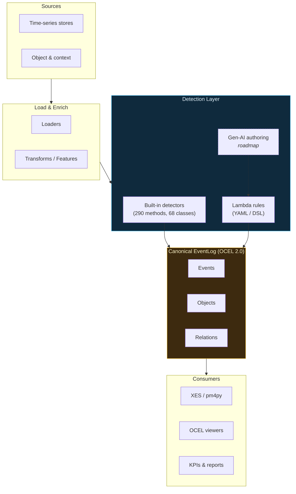
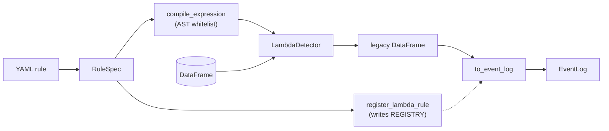
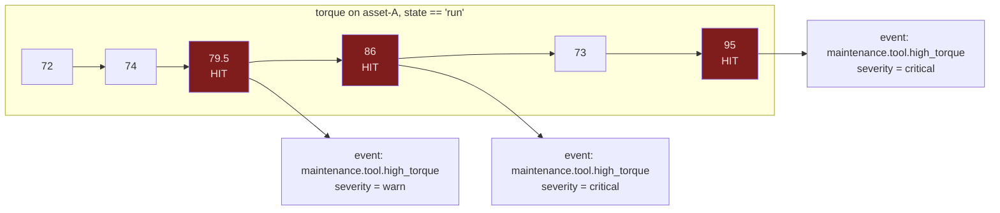
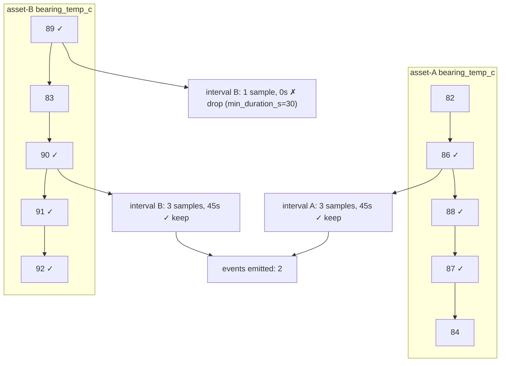
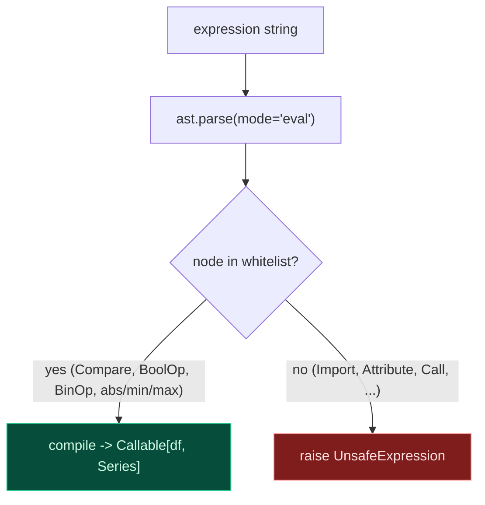

# Lambda Rules: declarative, user-authored detectors

ts-shape ships ~290 hand-written detector methods across 68 classes — a curated industry library covering machine state, OEE, SPC, drift, vibration, energy, supply chain, and more. They are precise, opinionated, and parametric. They are also code: every new detection idea requires a new Python class, a new taxonomy entry, a new archetype, a new test.

The **lambda-rule** subsystem coexists with that library. You declare a rule in YAML (or a dict), the loader compiles it into a `LambdaDetector`, and it joins the same `REGISTRY` the built-ins live in. From that point on the canonical-event-log pipeline does not care which kind of detector emitted the row — the rule's output flows through the same shape-driven adapter, severity bucketing, object auto-extraction, OCEL / XES export, `concat`, and schema validation.

No new pipeline. No refactor of existing detectors. The same `EventLog`.

---

## At a glance



The lambda subsystem occupies the middle column alongside the built-ins. A future gen-AI authoring layer (roadmap, dashed) will emit lambda rules — not new Python code — so it shares the safety net of the AST-restricted expression compiler.

---

## How a lambda rule flows through the system



The trigger expression is compiled once, the spec is written into `REGISTRY` once, and from then on the detector behaves identically to a built-in: the same `to_event_log(df, detector="...")` entry point dispatches on the detector name, finds the same `LabelRule`, and runs the same shape-driven adapter.

---

## Case 1 — point/threshold: "high torque on a running tool"

**Plant context.** A CNC tool experiences occasional torque spikes when machining harder material or when wear is progressing. We want a point event every time torque exceeds 75 Nm *while the machine is running* (not during retracts or setups), with severity derived from a precomputed `severity_score` column. Downstream, these events feed an OEE dashboard's "tool stress" panel and a maintenance scheduler.

**Signals required.** `torque` (float), `state` (`"run"` / `"idle"`), `severity_score` (float; 4.5 → critical, 3.0 → warn, else info), `source_uuid` (string; auto-extracts to `asset`).

**Rule.**

```yaml
- id: high_torque
  class_name: LambdaToolWear
  method_name: high_torque
  pack: maintenance
  shape: point
  archetype: threshold
  template: "maintenance.tool.high_torque"
  produces_objects: [asset]
  severity_field: severity_score
  value_field: torque
  trigger:
    expression: "(torque > 75) & (state == 'run')"
  standard_attrs:
    ts_shape:method: lambda_threshold
    ts_shape:direction: above
    ts_shape:threshold_high: 75.0
```

**What happens.**



**Resulting EventLog row (one of three).**

| Column | Value |
|---|---|
| `ocel:eid` | `e-f0aab89f-345c-…` |
| `ocel:activity` | `maintenance.tool.high_torque` |
| `ocel:timestamp` | `2026-05-07 08:05:00+00:00` |
| `ts_shape:detector` | `LambdaToolWear.high_torque` |
| `ts_shape:pack` | `maintenance` |
| `ts_shape:severity` | `warn` |
| `ts_shape:value` | `79.5` |
| `ts_shape:method` | `lambda_threshold` |
| `ts_shape:direction` | `above` |
| `ts_shape:threshold_high` | `75.0` |
| `maintenance:source_uuid` | `asset-A` |

The relations table receives a row tying this event to `(asset, asset-A)` — auto-extracted from `source_uuid` because the rule declared `produces_objects: [asset]`.

---

## Case 2 — interval / hysteresis / group-by: "bearing hot window per asset"

**Plant context.** A line of identical pumps occasionally runs hot. Short single-sample spikes are sensor noise; we only care about *sustained* windows of ≥ 30 seconds, and we want one event per machine — not a global one. Downstream, these intervals feed a predictive-maintenance model that buckets time-above-threshold per asset.

**Signals required.** `bearing_temp_c` (float), `source_uuid` (string), a datetime column (`systime`).

**Rule.**

```yaml
- id: bearing_hot
  class_name: LambdaBearing
  method_name: hot_window
  pack: maintenance
  shape: interval
  archetype: interval
  template: "maintenance.bearing.hot"
  produces_objects: [asset]
  value_field: bearing_temp_c
  trigger:
    expression: "bearing_temp_c > 85"
    min_duration_s: 30
    group_by: [source_uuid]
  standard_attrs:
    ts_shape:lifecycle_state: hot
```

**What happens.**



The evaluator groups by `source_uuid`, finds contiguous True runs *per group*, and drops anything shorter than `min_duration_s`. Each surviving run becomes one row with `start`, `end`, the mean of `value_field` over the run, and the group key.

**Resulting EventLog row (one of two).**

| Column | Value |
|---|---|
| `ocel:activity` | `maintenance.bearing.hot` |
| `ocel:timestamp` | `2026-05-07 08:14:30+00:00` (interval end) |
| `ts_shape:start_timestamp` | `2026-05-07 08:10:00+00:00` |
| `ts_shape:duration_s` | `270.0` |
| `ts_shape:value` | `87.4` (mean over the window) |
| `ts_shape:lifecycle_state` | `hot` |
| `maintenance:source_uuid` | `asset-A` |

Relations again carry the `(asset, asset-A)` binding — auto-extracted because the rule declared `produces_objects: [asset]` and the input frame had a `source_uuid` column.

---

## Expression language

Trigger expressions are written in **a tiny subset of Python**. The compiler parses with `ast.parse(mode="eval")` and walks the tree, rejecting any node not on a small allowlist.



**Allowed.**

- Comparisons: `<`, `<=`, `>`, `>=`, `==`, `!=`, `in`, `not in`
- Vectorized boolean ops: `&` (and), `|` (or), `~` (not)
- Arithmetic: `+`, `-`, `*`, `/`, `%`, unary `-`/`+`
- Constants and column-name references (any column in the input DataFrame)
- Function calls: only `abs`, `min`, `max`

**Rejected (raises `UnsafeExpression`).** Imports, attribute access, indexing, comprehensions, lambdas, any function call that isn't on the allowlist, dunder access, statements, assignments.

**Operator-precedence gotcha.** Python's bitwise `&` and `|` (the vectorized ones pandas understands) bind *tighter* than comparison operators, so wrap each comparison in parens:

```python
"(torque > 75) & (state == 'run')"   # correct
"torque > 75 & state == 'run'"        # wrong — parses as torque > (75 & state) == 'run'
```

Same convention as `pandas.eval` and `DataFrame.query`.

---

## Registration and lifecycle

Two ways in:

```python
from ts_shape.eventlog import load_yaml, register_lambda_rule, RuleSpec, TriggerSpec

# 1. From a YAML file.
detectors = load_yaml("rules.yaml")

# 2. From a hand-built spec.
det = register_lambda_rule(RuleSpec(
    id="high_torque",
    class_name="LambdaToolWear",
    method_name="high_torque",
    pack="maintenance",
    shape="point",
    archetype="threshold",
    template="maintenance.tool.high_torque",
    trigger=TriggerSpec(expression="(torque > 75) & (state == 'run')"),
    severity_field="severity_score",
    value_field="torque",
    standard_attrs={
        "ts_shape:method": "lambda_threshold",
        "ts_shape:direction": "above",
        "ts_shape:threshold_high": 75.0,
    },
))
```

Both call paths end up in the same `REGISTRY` mutation. From there:

```python
log = det.to_event_log(df)                      # one rule
log = concat(det_a.to_event_log(df),            # many rules
             det_b.to_event_log(df))
```

`unregister_lambda_rule(class_name, method_name)` removes a rule cleanly — useful in tests, demos, and reloadable notebooks. Lambda rules live in-process only; persistence is a roadmap item.

---

## Backtest

The MVP backtest is hit-counting + severity/asset histograms — the surface area required to validate that a rule does what you expect, before you ship it.

```python
from ts_shape.eventlog import run_backtest

result = run_backtest(det, df)
print(result.hit_count)        # 3
print(result.by_severity)      # {'critical': 2, 'warn': 1}
print(result.by_asset)         # {'asset-A': 3}
result.event_log               # the full EventLog — slice it any way you want
```

Precision/recall against labelled historical events is a roadmap item (Phase 4 expanded), as is multi-rule diffing.

---

## What's next

The lambda subsystem is the substrate for two AI-authoring features on the roadmap:

- **Rule recommendation from data** — an LLM ingests dataset statistics (and optional labelled events) and proposes candidate lambda rules in this same DSL. The AST-restricted compiler is the safety net: anything the LLM emits that does not type-check, or that touches a disallowed AST node, is silently rejected. Surviving candidates are backtested.
- **Detector recommender** — given a process description and a list of signals, an LLM picks from the 290 built-in detectors (and recommended parameters) — grounded in the same `LabelRule` taxonomy used here. The output is verified against `REGISTRY` keys before being returned to avoid hallucinated method names.

Both rely on (a) the canonical-event-log plumbing already in place, (b) the lambda DSL described above, and (c) the AST whitelist as the safety boundary.

Other roadmap items: rule packs (versioned YAML bundles per industry), streaming evaluation over chunked DataFrames, polars backend, and labelled backtest scoring (precision/recall).

For an end-to-end runnable example see [`examples/lambda_rules_demo.py`](https://github.com/ts-shape/ts-shape/blob/main/examples/lambda_rules_demo.py). For the canonical schema the rules ultimately emit into, see the [Event Log guide](eventlog.md). For a side-by-side view of how every detection archetype flows from raw signals through events to rule definitions, see [Event Handling — Visual Overview](event-handling-flow.md).
