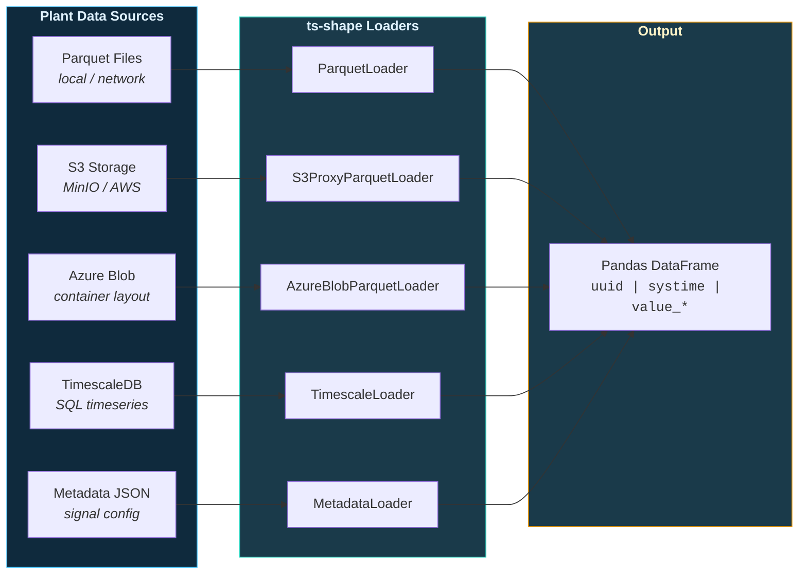

# Data Acquisition

Connect to plant historians, data lakes, and metadata stores. Every loader returns a standard Pandas DataFrame.

---

## Data Sources



---

## Loading from Parquet Files

The most common pattern for offline analysis — load all parquet files from a directory.

```python
from ts_shape.loader.timeseries.parquet_loader import ParquetLoader

# Load all parquet files from a directory
df = ParquetLoader.load_all_files("data/sensors/")

print(df.head())
#          uuid                   systime  value_double
# 0  temperature  2024-01-01 00:00:00+00:00         23.5
# 1  temperature  2024-01-01 00:01:00+00:00         23.7
# 2     pressure  2024-01-01 00:00:00+00:00       1013.2
```

---

## Loading from Azure Blob Storage

Three authentication methods are supported. Pick whichever matches your plant's IT setup.

### Connect with a SAS URL (simplest)

```python
from ts_shape.loader.timeseries.azure_blob_loader import AzureBlobParquetLoader

loader = AzureBlobParquetLoader(
    sas_url="https://myaccount.blob.core.windows.net/timeseries?sv=2021-06-08&st=...&se=...&sr=c&sp=rl&sig=...",
    prefix="parquet/",
)
```

### Connect with a connection string

```python
loader = AzureBlobParquetLoader(
    connection_string="DefaultEndpointsProtocol=https;AccountName=...;AccountKey=...",
    container_name="timeseries",
    prefix="parquet/",
)
```

### Connect with AAD credential

```python
from azure.identity import DefaultAzureCredential

loader = AzureBlobParquetLoader(
    account_url="https://myaccount.blob.core.windows.net",
    container_name="timeseries",
    credential=DefaultAzureCredential(),
    prefix="parquet/",
)
```

### Explore container structure

```python
structure = loader.list_structure(limit=20)
print("Folders:", structure["folders"])
print("Files:",   structure["files"])
```

### Load by time range

```python
# Requires time-structured folders: prefix/YYYY/MM/DD/HH/
df = loader.load_by_time_range("2024-01-15 08:00", "2024-01-15 12:00")
```

### Load by time range and specific UUIDs

```python
df = loader.load_files_by_time_range_and_uuids(
    start_timestamp="2024-01-15 08:00",
    end_timestamp="2024-01-15 12:00",
    uuid_list=["temperature", "pressure", "humidity"],
)
```

### Stream results (low memory)

```python
for blob_name, chunk_df in loader.stream_by_time_range("2024-01-15 08:00", "2024-01-15 12:00"):
    print(f"{blob_name}: {len(chunk_df)} rows")
    process(chunk_df)
```

### Non-parquet files (CSV, JSON, XML)

```python
from ts_shape.loader.timeseries.azure_blob_loader import AzureBlobFlexibleFileLoader

loader = AzureBlobFlexibleFileLoader(
    sas_url="https://myaccount.blob.core.windows.net/rawdata?sv=...&sig=...",
    prefix="incoming/",
)

# List files by time range and extension
names = loader.list_files_by_time_range(
    start_timestamp="2024-01-15 08:00",
    end_timestamp="2024-01-15 12:00",
    extensions=[".csv", ".json"],
)

# Download and auto-parse
results = loader.fetch_files_by_time_range(
    start_timestamp="2024-01-15 08:00",
    end_timestamp="2024-01-15 12:00",
    extensions=[".csv"],
    parse=True,
)
```

---

## Loading from S3-Compatible Storage

```python
from ts_shape.loader.timeseries.s3proxy_parquet_loader import S3ProxyParquetLoader

loader = S3ProxyParquetLoader(
    endpoint_url="https://s3.example.com",
    bucket="data-lake",
    prefix="timeseries/"
)
df = loader.fetch_data_as_dataframe()
```

---

## Loading from Databricks

The canonical hourly layout (`<base>/YYYY/MM/DD/HH/<uuid>.parquet`) can be read
from Databricks two ways. Pick by **who does the scan**.

### Mounted Unity Catalog Volume (pandas)

`DatabricksUnityParquetLoader` reads the FUSE-mounted UC Volume directly with
`pandas.read_parquet` — no Spark, no download. Best for light, driver-local
reads with column/row pushdown and optional streaming.

```python
from ts_shape.loader.timeseries.databricks_unity_parquet_loader import (
    DatabricksUnityParquetLoader,
)

loader = DatabricksUnityParquetLoader(
    catalog="main", schema="plant", volume="timeseries", prefix="parquet",
)
df = loader.load_by_time_range("2026-06-19 06:00", "2026-06-19 14:00")
```

### Spark-native read (`DatabricksSparkParquetLoader`)

`DatabricksSparkParquetLoader` lets the **cluster's Spark session** do the scan
(distributed read, predicate/column pushdown) and collects to pandas only at the
end. It generalizes the common notebook idiom

```python
hours = pd.date_range(start, end, freq="h")
paths = [f"{base}/{h:%Y/%m/%d/%H}/{uuid}.parquet" for h in hours]
sdf = spark.read.option("basePath", base).parquet(*paths)
df = sdf.select("systime", "uuid", "value_integer").toPandas()
```

into a reusable, parameterized loader:

```python
from ts_shape.loader.timeseries.databricks_spark_parquet_loader import (
    DatabricksSparkParquetLoader,
)

# `spark` defaults to the active session inside Databricks; pass it explicitly
# off-cluster. pyspark stays an optional, lazily-imported dependency.
loader = DatabricksSparkParquetLoader("/Volumes/main/plant/timeseries", spark=spark)

df = loader.load_by_time_range_and_uuids(
    "2026-06-19 06:00", "2026-06-19 14:00",
    uuids=["ABC", "DEF"],                 # one UUID or a list
    columns=["systime", "uuid", "value_integer"],  # projection pushdown
    filter_expr="value_integer > 0",      # Spark SQL predicate
)                                          # -> pandas; as_pandas=False -> Spark DataFrame
```

Key options:

| Argument | Purpose |
|----------|---------|
| `uuids` | A single UUID or a list; one path is built per *(hour, uuid)*. |
| `columns` | Columns to `select` (projection pushdown). |
| `filter_expr` | Spark SQL predicate applied with `.where`. |
| `hour_pattern` / `file_template` | Customize the folder/file layout (defaults match ts-shape). |
| `ignore_missing` | Skip hours with no file for a UUID instead of failing (default `True`). |
| `path_exists` | Optional callable (e.g. over `dbutils.fs`) to pre-filter to existing paths. |
| `as_pandas` | Return pandas (`True`, default) or the Spark DataFrame (`False`). |

The path construction is exposed as a pure, Spark-free method so you can inspect
exactly what will be read (and unit-test it off-cluster):

```python
loader.build_paths("2026-06-19 06:00", "2026-06-19 08:00", ["ABC"])
# ['/Volumes/main/plant/timeseries/2026/06/19/06/ABC.parquet',
#  '/Volumes/main/plant/timeseries/2026/06/19/07/ABC.parquet',
#  '/Volumes/main/plant/timeseries/2026/06/19/08/ABC.parquet']
```

> **Which one?** Use the Unity loader for cheap driver-local reads of a mounted
> Volume; use the Spark loader when you want Spark to distribute the scan or you
> are already working with Spark DataFrames.

---

## Loading Metadata

Signal metadata (names, units, configuration) stored in JSON files.

```python
from ts_shape.loader.metadata.metadata_json_loader import MetadataLoader

meta = MetadataLoader("config/signals.json").to_df()

print(meta)
#          uuid         label    unit
# 0  temperature  Temperature  Celsius
# 1     pressure     Pressure     hPa
```

---

## Combining Timeseries with Metadata

Join signal data with metadata for enriched analysis.

```python
from ts_shape.loader.combine.integrator import DataIntegratorHybrid

combined = DataIntegratorHybrid.combine_data(
    timeseries_sources=[ts_df],
    metadata_sources=[meta_df],
    join_key="uuid",
    merge_how="left"
)

print(combined.head())
#          uuid                   systime  value_double        label     unit
# 0  temperature  2024-01-01 00:00:00+00:00         23.5  Temperature  Celsius
```

### Filter by specific signals

```python
combined = DataIntegratorHybrid.combine_data(
    timeseries_sources=[ts_df],
    metadata_sources=[meta_df],
    uuids=["temperature", "humidity"],
    join_key="uuid"
)
```

---

## Module Deep Dives

**Supply Chain:** [Inventory Monitoring](../modules/supplychain/inventory-monitoring.md) | [Lead Time Analysis](../modules/supplychain/lead-time-analysis.md) | [Demand Patterns](../modules/supplychain/demand-patterns.md)

---

## Next Steps

- [Signal Conditioning](transforms.md) — Clean and filter the loaded data
- [API Reference](../reference/index.md) — Full loader API documentation
