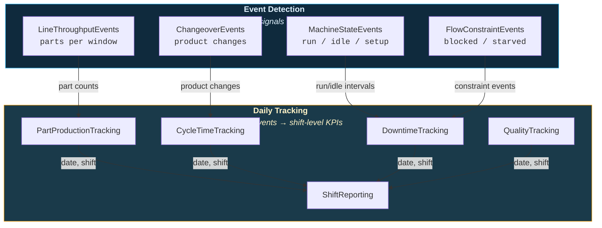

# Production Monitoring

Track machine states, line throughput, changeovers, downtime, cycle times, and shift performance on the shop floor. These classes form the operational backbone of plant analytics.

---

## Production Class Map



---

## Machine State Events

Detect run/idle intervals and state transitions from boolean or string state signals.

```python
from ts_shape.events.production.machine_state import MachineStateEvents

state = MachineStateEvents(df, run_state_uuid='machine_running')

# Run/idle intervals with minimum duration filter
intervals = state.detect_run_idle(min_duration='30s')

# State transitions (every change from one state to another)
transitions = state.transition_events()

# Detect rapid state changes (may indicate sensor noise)
rapid = state.detect_rapid_transitions(threshold='5s', min_count=3)

# Quality metrics for the state signal itself
metrics = state.state_quality_metrics()
print(f"Run/Idle ratio: {metrics['run_idle_ratio']:.2f}")
```

---

## Line Throughput Events

Count parts per time window, check takt adherence, and detect throughput trends.

```python
from ts_shape.events.production.line_throughput import LineThroughputEvents

throughput = LineThroughputEvents(df)

# Parts per minute
counts = throughput.count_parts(counter_uuid='part_counter', window='1m')

# Takt adherence — flag cycles exceeding takt time
violations = throughput.takt_adherence(
    cycle_uuid='cycle_complete', takt_time='60s'
)

# Throughput trends with degradation detection
trends = throughput.throughput_trends(
    counter_uuid='part_counter', window='1h', trend_window=24
)
```

---

## Changeover Detection

Detect product/recipe changeovers and compute changeover windows.

```python
from ts_shape.events.production.changeover import ChangeoverEvents

changeover = ChangeoverEvents(df)

# Detect changeovers (product signal changes)
changes = changeover.detect_changeover(product_uuid='product_signal', min_hold='5m')

# Fixed-duration changeover window
windows = changeover.changeover_window(
    product_uuid='product_signal',
    until='fixed_window',
    config={'duration': '10m'}
)

# Stability-based changeover window (waits for process to settle)
windows = changeover.changeover_window(
    product_uuid='product_signal',
    until='stable_band',
    config={
        'metrics': [
            {'uuid': 'temperature', 'band': 2.0, 'hold': '2m'},
            {'uuid': 'pressure', 'band': 5.0, 'hold': '2m'},
        ],
        'reference_method': 'ewma'
    }
)
```

---

## Flow Constraint Events

Detect blockages (downstream full) and starvation (upstream empty) between stations.

```python
from ts_shape.events.production.flow_constraint import FlowConstraintEvents

flow = FlowConstraintEvents(df)

# Define station roles
roles = {
    'upstream_run': 'station_1_running',
    'downstream_run': 'station_2_running',
}

# Detect blocked events (station 1 running but station 2 stopped)
blocked = flow.blocked_events(roles=roles, tolerance='200ms', min_duration='5s')

# Detect starved events (station 2 running but station 1 stopped)
starved = flow.starved_events(roles=roles, tolerance='200ms', min_duration='5s')

# Full analytics with severity classification
analytics = flow.flow_constraint_analytics(
    roles=roles, minor_threshold='5s', moderate_threshold='30s'
)
```

---

## Part Production Tracking

Track production quantities by part number with time-based aggregation.

```python
from ts_shape.events.production.part_tracking import PartProductionTracking

tracker = PartProductionTracking(df)

# Hourly production by part
hourly = tracker.production_by_part(
    part_id_uuid='part_number_signal',
    counter_uuid='counter_signal',
    window='1h'
)

# Daily production summary
daily = tracker.daily_production_summary(
    part_id_uuid='part_number_signal',
    counter_uuid='counter_signal'
)

# Total production for a date range
totals = tracker.production_totals(
    part_id_uuid='part_number_signal',
    counter_uuid='counter_signal',
    start_date='2024-01-01',
    end_date='2024-01-31'
)
```

### Handling counter resets

Production counters are assumed to increase as parts are produced. Many counters reset back to zero (or a lower value) at a shift change, a part change, or a controller restart. By default the quantity is `max(0, last_count - first_count)`, so **any window where the counter drops reports 0 and silently loses that window's production**.

Pass `handle_resets=True` to count production correctly across resets. The quantity becomes the sum of per-reading increments, where a drop is treated as a reset that contributes the new counter value. The result gains a `resets` column counting resets per window/day/range. The same flag is available on `daily_production_summary` and `production_totals`.

```python
# Reset-aware hourly production (adds a `resets` column)
hourly = tracker.production_by_part(
    part_id_uuid='part_number_signal',
    counter_uuid='counter_signal',
    window='1h',
    handle_resets=True,
)

# Inspect exactly when and how far the counter reset
resets = tracker.detect_resets(
    part_id_uuid='part_number_signal',
    counter_uuid='counter_signal',
)
#             systime  part_number  count_before  count_after  drop
#  2026-06-15 17:00:00  8842580               432           61   371
#  2026-06-16 19:00:00  9423376               854            0   854
```

!!! tip "Confirm reset behavior first"
    Use `detect_resets()` to check whether and when your counter resets. If it never resets, the default (`handle_resets=False`) and the reset-aware result are identical; enable the flag whenever resets are expected.

---

## Cycle Time Tracking

Analyze cycle times with trend detection and slow cycle identification.

```python
from ts_shape.events.production.cycle_time_tracking import CycleTimeTracking

tracker = CycleTimeTracking(df)

# Statistics by part (min, avg, max, std, median)
stats = tracker.cycle_time_statistics(
    part_id_uuid='part_number_signal',
    cycle_trigger_uuid='cycle_complete_signal'
)

# Detect slow cycles (>1.5x median)
slow = tracker.detect_slow_cycles(
    part_id_uuid='part_number_signal',
    cycle_trigger_uuid='cycle_complete_signal',
    threshold_factor=1.5
)

# Trend analysis with rolling window
trend = tracker.cycle_time_trend(
    part_id_uuid='part_number_signal',
    cycle_trigger_uuid='cycle_complete_signal',
    part_number='PART_A',
    window_size=20
)
```

---

## Downtime Tracking

Track machine downtime by shift, reason, and availability trends.

```python
from ts_shape.events.production.downtime_tracking import DowntimeTracking

tracker = DowntimeTracking(df)

# Downtime per shift with availability
shift_downtime = tracker.downtime_by_shift(
    state_uuid='machine_state', running_value='Running'
)
#     date        shift    downtime_minutes  uptime_minutes  availability_pct
# 0   2024-01-01  shift_1  45.2             434.8           90.6

# Pareto of downtime reasons
reasons = tracker.downtime_by_reason(
    state_uuid='machine_state',
    reason_uuid='downtime_reason',
    stopped_value='Stopped'
)

# Top 5 downtime reasons
top = tracker.top_downtime_reasons(
    state_uuid='machine_state', reason_uuid='downtime_reason', top_n=5
)

# Availability trend
trend = tracker.availability_trend(
    state_uuid='machine_state', running_value='Running', window='1D'
)
```

---

## Quality Tracking (NOK/Scrap)

Track defective parts, first-pass yield, and defect reasons.

```python
from ts_shape.events.production.quality_tracking import QualityTracking

tracker = QualityTracking(df, shift_definitions={
    "day": ("06:00", "14:00"),
    "afternoon": ("14:00", "22:00"),
    "night": ("22:00", "06:00"),
})

# NOK parts per shift with first-pass yield
shift_quality = tracker.nok_by_shift(
    ok_counter_uuid='good_parts', nok_counter_uuid='bad_parts'
)

# Quality by part number
part_quality = tracker.quality_by_part(
    ok_counter_uuid='good_parts',
    nok_counter_uuid='bad_parts',
    part_id_uuid='part_number'
)

# Pareto of defect reasons
reasons = tracker.nok_by_reason(
    nok_counter_uuid='bad_parts', defect_reason_uuid='defect_code'
)
```

---

## Shift Reporting

Compare shift performance and track against targets.

```python
from ts_shape.events.production.shift_reporting import ShiftReporting

reporter = ShiftReporting(df)

# Production per shift
shift_prod = reporter.shift_production(
    counter_uuid='counter_signal', part_id_uuid='part_number_signal'
)

# Compare shifts (last 7 days)
comparison = reporter.shift_comparison(counter_uuid='counter_signal', days=7)

# Track against targets
targets = reporter.shift_targets(
    counter_uuid='counter_signal',
    targets={'shift_1': 450, 'shift_2': 450, 'shift_3': 400}
)

# Best and worst shifts
results = reporter.best_and_worst_shifts(counter_uuid='counter_signal')
```

---

## How They Connect

| From | To | Merge Key | Purpose |
|------|----|-----------|---------|
| `MachineStateEvents` | `DowntimeTracking` | run/idle intervals | Calculate downtime from state changes |
| `LineThroughputEvents` | `PartProductionTracking` | part counts per window | Aggregate to daily/shift totals |
| `ChangeoverEvents` | `CycleTimeTracking` | product change timestamps | Exclude changeover time from cycle analysis |
| `DowntimeTracking` | `ShiftReporting` | `date`, `shift` | Feed downtime into shift report |
| `PartProductionTracking` | `ShiftReporting` | `date`, `shift` | Feed production counts into shift report |
| `QualityTracking` | `ShiftReporting` | `date`, `shift` | Feed quality metrics into shift report |

---

## Module Deep Dives

**Event Detection:** [Machine State](../modules/production/machine-state.md) | [Line Throughput](../modules/production/line-throughput.md) | [Changeover](../modules/production/changeover.md) | [Flow Constraints](../modules/production/flow-constraints.md)

**Daily Tracking:** [Part Tracking](../modules/production/part-tracking.md) | [Cycle Time](../modules/production/cycle-time.md) | [Downtime](../modules/production/downtime.md) | [Quality Tracking](../modules/production/quality-tracking.md) | [Shift Reporting](../modules/production/shift-reporting.md)

---

## Next Steps

- [OEE & Plant Analytics](oee-analytics.md) — Combine availability, performance, quality into OEE
- [Shift Reports & KPIs](reporting.md) — Performance loss, scrap, targets, handover reports
- [API Reference](../reference/index.md) — Full production API documentation
