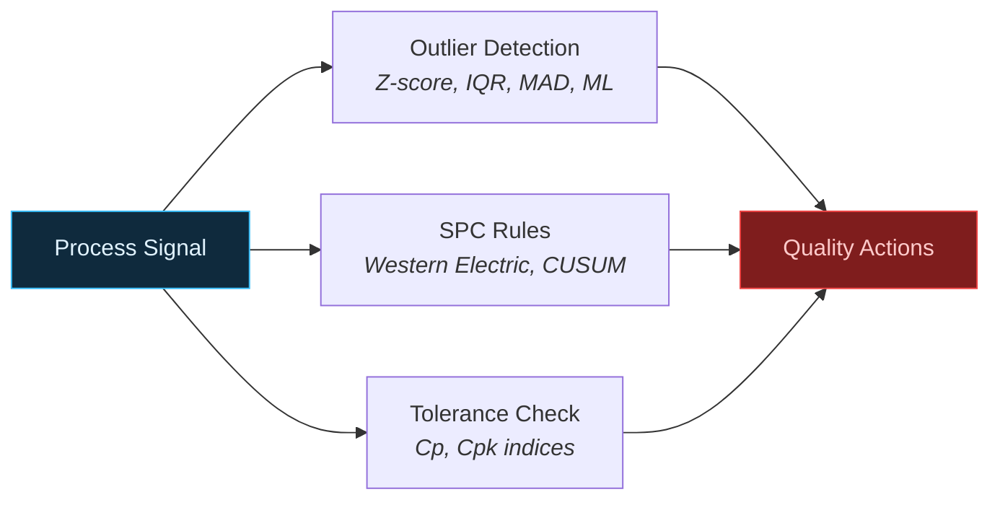

# Quality Control & SPC

Detect outliers, apply Statistical Process Control rules, and compute process capability indices. Built for inline quality monitoring on the shop floor.

---

## Quality Analysis Flow



---

## Outlier Detection

Four detection methods, each suited to different signal distributions.

| Method | Best For | Robustness |
|--------|----------|------------|
| **Z-score** | Normal distributions | Low — sensitive to extremes |
| **IQR** | Skewed distributions | Medium |
| **MAD** | Heavy-tailed / noisy signals | High — most robust |
| **IsolationForest** | Complex multivariate patterns | High — ML-based |

### Basic outlier detection

```python
from ts_shape.events.quality.outlier_detection import OutlierDetection

# Z-score (values > 3 std from mean)
outliers = OutlierDetection.detect_zscore_outliers(df, "value_double", threshold=3.0)
print(f"Found {len(outliers)} outliers")

# IQR-based
outliers = OutlierDetection.detect_iqr_outliers(df, "value_double", multiplier=1.5)
```

### Advanced outlier detection with severity scores

```python
from ts_shape.events.quality.outlier_detection import OutlierDetectionEvents

detector = OutlierDetectionEvents(
    dataframe=df,
    value_column="value_double",
    event_uuid="outlier_event",
    time_threshold="5min"
)

# MAD method (most robust for industrial signals)
outliers_mad = detector.detect_outliers_mad(threshold=3.5)

# IsolationForest (ML-based — detects complex anomaly patterns)
outliers_ml = detector.detect_outliers_isolation_forest(
    contamination=0.1, random_state=42
)

# All methods return a numeric severity column
print(outliers_mad[['systime', 'value_double', 'severity']])
```

---

## Statistical Process Control (SPC)

Full Western Electric Rules and CUSUM shift detection per ISA/IEC standards.

```python
from ts_shape.events.quality.statistical_process_control import StatisticalProcessControlRuleBased

spc = StatisticalProcessControlRuleBased(
    dataframe=df,
    value_column="value_double",
    tolerance_uuid="control_limits",
    actual_uuid="measurements",
    event_uuid="spc_violation"
)

# Calculate control limits
limits = spc.calculate_control_limits()
print(f"Mean: {limits['mean'][0]:.2f}")
print(f"UCL (3s): {limits['3sigma_upper'][0]:.2f}")
print(f"LCL (3s): {limits['3sigma_lower'][0]:.2f}")

# Dynamic control limits (adapts over time)
dynamic_limits = spc.calculate_dynamic_control_limits(method='ewma', window=20)
```

### Western Electric Rules

```python
# Apply all 8 Western Electric Rules
violations = spc.apply_rules_vectorized()

# Or select specific rules
violations = spc.apply_rules_vectorized(
    selected_rules=['rule_1', 'rule_2', 'rule_3']
)

# Human-readable interpretations
interpreted = spc.interpret_violations(violations)
print(interpreted[['systime', 'rule', 'interpretation', 'recommendation']])
```

### CUSUM Shift Detection

Sensitive to small, sustained shifts in the process mean.

```python
shifts = spc.detect_cusum_shifts(k=0.5, h=5.0)
print(shifts[['systime', 'shift_direction', 'severity']])
```

---

## Tolerance Deviation & Process Capability

Check values against specification limits and compute Cp/Cpk indices.

### Simple tolerance check

```python
from ts_shape.events.quality.tolerance_deviation import ToleranceDeviation

deviations = ToleranceDeviation.detect_out_of_tolerance(
    df, column="value_double", upper_limit=100, lower_limit=0
)
```

### Process Capability Indices (Cp/Cpk)

```python
from ts_shape.events.quality.tolerance_deviation import ToleranceDeviationEvents

tolerance_checker = ToleranceDeviationEvents(
    dataframe=df,
    tolerance_column="value_double",
    actual_column="value_double",
    upper_tolerance_uuid="upper_spec_limit",
    lower_tolerance_uuid="lower_spec_limit",
    actual_uuid="measurements",
    event_uuid="deviation_event",
    warning_threshold=0.8  # 80% of tolerance = warning zone
)

capability = tolerance_checker.compute_capability_indices()
print(f"Cp:  {capability['Cp']:.3f}")   # Potential capability
print(f"Cpk: {capability['Cpk']:.3f}")  # Actual capability

if capability['Cpk'] >= 1.33:
    print("Process is capable")
elif capability['Cpk'] >= 1.0:
    print("Process needs improvement")
else:
    print("Process is not capable")
```

---

## Module Deep Dives

| Module | Description |
|--------|-------------|
| [Outlier Detection](../modules/quality/outlier-detection.md) | Z-score, IQR, MAD, Isolation Forest |
| [Statistical Process Control](../modules/quality/spc.md) | 8 Western Electric rules, CUSUM |
| [Tolerance Deviation](../modules/quality/tolerance-deviation.md) | Spec limits, severity, Cp/Cpk |
| [Anomaly Classification](../modules/quality/anomaly-classification.md) | Spike, drift, oscillation, flatline |
| [Signal Quality](../modules/quality/signal-quality.md) | Gaps, sampling regularity, completeness |
| [Sensor Drift](../modules/quality/sensor-drift.md) | Zero drift, span drift, calibration health |
| [Multi-Sensor Validation](../modules/quality/multi-sensor-validation.md) | Cross-validate redundant sensors |
| [Gauge R&R](../modules/quality/gauge-rr.md) | Repeatability, reproducibility, MSA |
| [Capability Trending](../modules/quality/capability-trending.md) | Cpk trends, yield forecast |

---

## Next Steps

- [Production Monitoring](production.md) — Machine states and production tracking
- [OEE & Plant Analytics](oee-analytics.md) — Quality feeds into OEE calculation
- [API Reference](../reference/index.md) — Full quality API documentation
