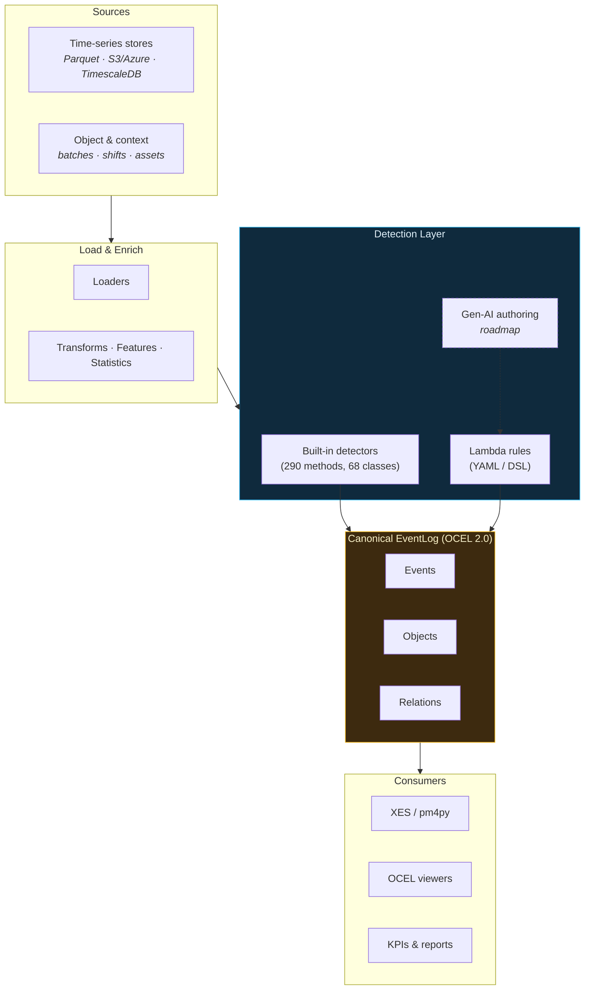

---
hide:
  - navigation
  - toc
---

<style>
.md-typeset h1 { display: none; }
</style>

<div class="tx-hero" markdown>

# **ts-shape**

<div class="tx-hero__tagline">
Timeseries analytics for manufacturing — from raw signals to production KPIs.
</div>

<div class="tx-hero__badges">
<a href="https://pypi.org/project/ts-shape/"></a>
<a href="https://pepy.tech/projects/ts-shape"></a>
<a href="https://pypi.org/project/ts-shape/"></a>
<a href="license.md"></a>
</div>

[Get Started](user_guide/installation.md){ .md-button .md-button--primary }
[Pipelines](pipelines/index.md){ .md-button }
[API Reference](reference/index.md){ .md-button }

</div>

---

<div class="tx-section-heading" markdown>

## Why ts-shape?

</div>

<div class="grid cards" markdown>

-   :material-lightning-bolt:{ .lg .middle } **DataFrame-First**

    ---

    Every operation accepts and returns Pandas DataFrames.
    No proprietary formats, no lock-in — plug into any notebook or dashboard.

-   :material-puzzle:{ .lg .middle } **Modular Design**

    ---

    Use only what you need. Loaders, transforms, features, and event detectors are fully decoupled.

-   :material-cloud-sync:{ .lg .middle } **Multi-Source Loading**

    ---

    Load from Parquet, S3, Azure Blob, or TimescaleDB with a unified interface. Enrich with JSON metadata.

-   :material-factory:{ .lg .middle } **Manufacturing-Ready**

    ---

    OEE, SPC, cycle times, downtime tracking, shift reports — built-in modules for real production use cases.

</div>

---

<div class="tx-section-heading" markdown>

## From Signals to Insights

</div>

=== "Load"

    ```python
    from ts_shape.loader.timeseries.parquet_loader import ParquetLoader

    uuids = ["machine-state", "part-counter", "temperature"]
    df = ParquetLoader.load_by_uuids("data/", uuids, "2024-01-01", "2024-01-31")
    ```

=== "Transform"

    ```python
    from ts_shape.transform.filter.numeric_filter import NumericFilter

    clean = NumericFilter.filter_value_in_range(df, "value_double", 0, 500)
    ```

=== "Analyze"

    ```python
    from ts_shape.features.stats.numeric_stats import NumericStatistics

    stats = NumericStatistics(clean, "value_double")
    print(f"Mean: {stats.mean():.2f}  Std: {stats.std():.2f}")
    ```

=== "Detect Events"

    ```python
    from ts_shape.events.production.machine_state import MachineStateEvents

    mse = MachineStateEvents(df, run_state_uuid="machine-state")
    intervals = mse.detect_run_idle(min_duration="30s")
    ```

---

<div class="tx-section-heading" markdown>

## Architecture

</div>



The detection layer is intentionally pluggable: hand-coded detector classes for the curated industry library, YAML-declared [lambda rules](guides/lambda-rules.md) for user-authored or per-site customizations, and (roadmap) gen-AI authoring that emits lambda rules — so it inherits the same AST-sandbox safety net. Whichever path a detection comes from, the output lands in the same canonical event log.

---

<div class="tx-section-heading" markdown>

## End-to-End Pipelines

</div>

Each pipeline starts with an Azure connection, a UUID list, and a time range — and produces actionable KPIs.

<div class="tx-pipeline-grid" markdown>
<div class="grid cards" markdown>

-   :material-gauge:{ .lg .middle } **[OEE Dashboard](pipelines/oee-dashboard.md)**

    ---

    Machine state + counters + rejects into daily Availability, Performance, Quality, and OEE by shift.

    **4 UUIDs**

-   :material-timer-outline:{ .lg .middle } **[Cycle Time Analysis](pipelines/cycle-time-analysis.md)**

    ---

    Cycle triggers + part numbers into statistics, slow-cycle detection, and golden-cycle comparison.

    **3 UUIDs**

-   :material-chart-bar:{ .lg .middle } **[Downtime Pareto](pipelines/downtime-pareto.md)**

    ---

    Machine state + reason codes into Pareto analysis, shift downtime, and availability trends.

    **2 UUIDs**

-   :material-shield-check:{ .lg .middle } **[Quality & SPC](pipelines/quality-spc.md)**

    ---

    Measurements + tolerances into outlier detection, SPC rule checks, and Cp/Cpk capability trending.

    **1+ UUIDs**

-   :material-cog-transfer:{ .lg .middle } **[Process Engineering](pipelines/process-engineering.md)**

    ---

    Setpoint + actual + state signals into setpoint adherence, startup detection, and stability scores.

    **3 UUIDs**

</div>
</div>

---

<div class="tx-section-heading" markdown>

## Core Modules

</div>

<div class="grid" markdown>

<div markdown>

### :material-database-import: Loaders

- **Parquet** — Local and remote files
- **S3 Proxy** — S3-compatible storage
- **Azure Blob** — Container layouts
- **TimescaleDB** — SQL timeseries
- **Metadata JSON** — Context enrichment

</div>

<div markdown>

### :material-filter: Transforms

- **Numeric Filter** — Range, threshold
- **String Filter** — Pattern matching
- **DateTime Filter** — Time ranges
- **Boolean Filter** — Flag filtering
- **Calculator** — Derived columns
- **Harmonization** — Multi-signal alignment

</div>

<div markdown>

### :material-chart-box: Features

- **Numeric Stats** — min, max, mean, std
- **Time Stats** — Coverage, gaps
- **String Stats** — Value counts
- **Cycles** — Extraction & processing

</div>

<div markdown>

### :material-factory: Events

- **Quality & SPC** — Outliers, control charts, Cp/Cpk
- **Production** — Machine states, downtime, changeovers
- **OEE** — Availability, performance, quality
- **Traceability** — Part tracking across stations
- **Engineering** — Setpoints, startup, steady-state
- **Maintenance** — Degradation, failure prediction

</div>

</div>

---

<div class="tx-section-heading" markdown>

## Data Model

</div>

ts-shape uses a simple long-format schema. Use only the columns you need.

| Column | Type | Description |
|--------|------|-------------|
| `uuid` | string | Signal identifier |
| `systime` | datetime | Timestamp |
| `value_double` | float | Numeric values |
| `value_integer` | int | Integer values |
| `value_string` | string | String values |
| `value_bool` | bool | Boolean values |

---

<div class="grid cards" markdown>

-   :material-book-open-variant:{ .lg .middle } **Concept**

    ---

    Architecture and design principles.

    [:octicons-arrow-right-24: Learn more](concept.md)

-   :material-code-tags:{ .lg .middle } **Guides**

    ---

    Topic-focused guides from data acquisition to shift reports.

    [:octicons-arrow-right-24: See guides](guides/index.md)

-   :material-pipe:{ .lg .middle } **Pipelines**

    ---

    End-to-end workflows from Azure to production KPIs.

    [:octicons-arrow-right-24: View pipelines](pipelines/index.md)

-   :material-api:{ .lg .middle } **API Reference**

    ---

    Complete auto-generated API documentation.

    [:octicons-arrow-right-24: Browse API](reference/index.md)

-   :material-test-tube:{ .lg .middle } **Examples**

    ---

    Runnable examples for every module category.

    [:octicons-arrow-right-24: Try examples](examples/index.md)

-   :material-github:{ .lg .middle } **GitHub**

    ---

    Source code, issues, and contributions.

    [:octicons-arrow-right-24: View source](https://github.com/ts-shape/ts-shape)

</div>

---

<div class="tx-section-heading" markdown>

## Try it live

</div>

Run `ts-shape` directly in your browser — no install required. The first run
downloads the Python runtime and may take a few seconds; later runs are instant.

<div id="ts-shape-repl" class="ts-repl">
  <textarea class="ts-repl__editor" spellcheck="false" aria-label="Python code editor"></textarea>
  <div class="ts-repl__toolbar">
    <button type="button" class="ts-repl__run">Run</button>
    <button type="button" class="ts-repl__reset">Reset</button>
    <span class="ts-repl__status"></span>
  </div>
  <pre class="ts-repl__output" aria-live="polite"></pre>
</div>

---

<div align="center" markdown>

**MIT License** — Built for the timeseries community

</div>
