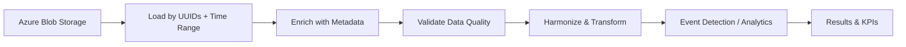

# Pipelines

End-to-end workflows that turn raw Azure timeseries into actionable production insights. Each pipeline starts with just three inputs:

1. **Azure connection config** (connection string, SAS URL, or AAD credentials)
2. **UUID list** (the signal identifiers for your use case)
3. **Time range** (start and end timestamps)

---

## Common Pattern

Every pipeline follows the same flow:



---

## Available Pipelines

<div class="grid cards" markdown>

-   :material-gauge:{ .lg .middle } **[OEE Dashboard](oee-dashboard.md)**

    ---

    Machine state, part counters, and reject signals into daily OEE breakdown by shift with availability, performance, and quality components.

    **Signals:** 4 UUIDs

-   :material-timer-outline:{ .lg .middle } **[Cycle Time Analysis](cycle-time-analysis.md)**

    ---

    Cycle triggers and part numbers into cycle time statistics, slow cycle detection, trend analysis, and golden cycle comparison.

    **Signals:** 3 UUIDs

-   :material-chart-bar:{ .lg .middle } **[Downtime Pareto](downtime-pareto.md)**

    ---

    Machine state and reason codes into Pareto analysis, shift-level downtime comparison, and availability trends.

    **Signals:** 2 UUIDs

-   :material-shield-check:{ .lg .middle } **[Quality & SPC](quality-spc.md)**

    ---

    Measurement signals with tolerances into outlier detection, SPC rule checks, control charts, and Cp/Cpk capability trending.

    **Signals:** 1+ measurement UUIDs

-   :material-cog-transfer:{ .lg .middle } **[Process Engineering](process-engineering.md)**

    ---

    Setpoint, actual value, and process state signals into setpoint adherence, startup detection, control loop health, and stability scores.

    **Signals:** 3 UUIDs

-   :material-pipe:{ .lg .middle } **[Pipeline](feature-pipeline.md)**

    ---

    Chain transforms, segmentation, feature computation, and detectors into a single reusable `Pipeline`. From raw timeseries to ML-ready feature tables and event logs.

    **Signals:** N process parameters + 1 order signal

</div>

---

## Prerequisites

All pipelines require:

```bash
pip install ts-shape
pip install azure-storage-blob   # for Azure loaders
```

For detailed module documentation, see the [API Reference](../reference/index.md) or the [Guides](../guides/index.md).
